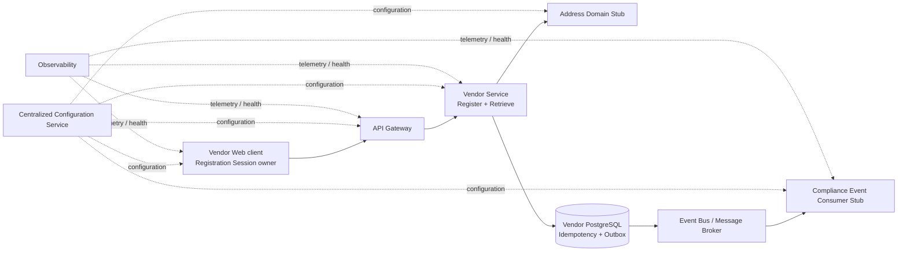

# HJ-010 - Current Application Architectural Concerns

| Field | Value |
|---|---|
| **Document ID** | HJ-010 |
| **Document Title** | Current Application Architectural Concerns |
| **Version** | 1.1 |
| **Status** | Approved |
| **Classification** | Architecture |
| **Owner** | Project Architecture |
| **Last Updated** | 15 August 2026 |

## Revision History

| Version | Date | Description |
|---|---|---|
| 0.1 | 11 August 2026 | First draft, titled *Application Architecture and Implementation Pattern Map*. Established a concern-centric mapping from the System Model and Epic 1 requirements to candidate patterns, DDD classification and ADR navigation. |
| 0.2 | 13 August 2026 | Applied CR-037. Renamed and restructured HJ-010 as the Current Application Architectural Concerns register; reconciled it with HJ-011 v1.1 and HJ-SM-001 v1.0; introduced the Approach, Resolution State, decision provenance, verification treatment and concern lifecycle; and completed the initial Epic 1 concern review. |
| 0.3 | 14 August 2026 | Applied CR-038. Limited Current Architectural Concerns to Exploring, Selected, Blocked and Challenged; separated architectural approval from downstream implementation and testing; added explicit blocker relationships; and renamed the planned architecture test destination to HJ-013. |
| 1.0 | 14 August 2026 | Applied CR-039. Established HJ-010 as the complete architectural concern register; retained Approved concerns; reconciled the first approved architecture batch; established synchronization with HJ-012; and published the first approved baseline. |
| 1.1 | 15 August 2026 | Applied CR-044. Aligned HJ-010 with HJ-107 v1.0 Approved and HJ-013 v1.0 Approved, removed obsolete planned and creation language, and changed no concern, Approach, Resolution State, Priority or verification responsibility. |

## Related Documents

| Document ID | Title | Status | Relationship |
|---|---|---|---|
| HJ-SM-001 v1.0 | System Model | Approved | Defines the approved system and Epic 1 concern-extraction baseline. |
| HJ-001 | Project Vision | Approved | Defines product vision and business scope. |
| HJ-002 | Architectural Principles | Approved | Provides architectural constraints and evaluation criteria. |
| HJ-003 | Ubiquitous Language Guide | Approved | Provides authoritative domain terminology. |
| HJ-004 | Vendor Domain Models | Approved | Defines Vendor behaviour, ownership and consistency boundaries. |
| HJ-005 | Coding Standards | Approved | Governs implementation and technical conventions where applicable. |
| HJ-006 | Testing Strategy and Standards | Approved | Governs test classification, design and quality. |
| HJ-007 | Enforcement Strategy | Approved | Defines enforcement mechanisms for architectural and engineering rules. |
| HJ-011 v1.1 | Epic 1 Vendor Registration Implementation Scope | Approved | Authoritative active implementation boundary. |
| HJ-104 | Vendor Registration Information Contract | Approved | Defines registration information, validation and ownership. |
| HJ-105 | Vendor Registration Sequence Diagram | Approved | Defines approved registration and retrieval interactions. |
| HJ-106 | Vendor Registration Service Contract | Approved | Defines RegisterVendor and RetrieveRegisteredVendor business service contracts. |
| HJ-107 v1.0 | Vendor Registration Test Catalogue | Approved | Approved behavioural-verification catalogue derived from HJ-106 and its authoritative sources. |
| HJ-013 v1.0 | Architecture and Implementation Test Catalogue | Approved | Approved architecture and implementation verification catalogue derived from applicable Approved architecture and delivery scope. |
| ADR-001 | Domain-Driven Design as the Primary Architectural Style | Accepted | Governs application of DDD patterns. |
| ADR-003 | Event-Driven Collaboration | Accepted | Governs asynchronous bounded-context collaboration. |
| ADR-004 | Vendor Lifecycle Begins After Successful Registration | Accepted | Governs registration lifecycle and Registration Session boundary. |
| ADR-005 | Registered Information vs Vendor Managed Information | Accepted | Governs information classification and ownership. |
| ADR-006 | Address Domain Ownership and Business Address Snapshots | Accepted | Governs Address authority and Vendor snapshot ownership. |
| ADR-007 | Vendor Compliance as a Separate Bounded Context | Accepted | Governs the Vendor-to-Compliance boundary. |
| ADR-008 | Idempotent Operations and Reliable Event Publication | Accepted | Governs RegisterVendor idempotency and reliable publication guarantees. |
| CR-037 | Restructure HJ-010 as the Current Application Architectural Concerns Register | Approved for application | Authorises this revision. |
| CR-038 | Align HJ-010 Concern Resolution and Approval Lifecycle | Approved for application | Authorises the v0.3 concern-resolution and approval lifecycle. |
| CR-039 | Establish Complete Concern Tracking and Publish First Approved Architecture Batch | Applied | Authorises the complete concern lifecycle, first approved batch and v1.0 baseline. |
| HJ-012 v1.0 | Established Application Architecture Patterns | Approved | Authoritative catalogue of approved application architecture and challenged resolutions retained for traceability. |

## 1. Purpose

HJ-010 is the authoritative and complete register of **Application Architectural Concerns** for the active implementation scope. It retains concerns whose Resolution State is **Exploring**, **Selected**, **Blocked**, **Approved** or **Challenged**.

For each concern it records:

- the architectural problem and **Required Guarantee**;
- the source or boundary that creates the concern;
- candidate approaches during exploration and the selected **Approach** after resolution;
- the concern's **Resolution State** and resolution priority;
- the decision, principle, standard, convention or implementation-local authority governing the resolution; and
- the verification treatment for any executable architectural guarantee.

HJ-010 is an architecture-navigation and concern-lifecycle artefact. It does not duplicate ADR rationale, engineering standards or test specifications. HJ-012 is the authoritative catalogue of approved application architecture; HJ-010 remains authoritative for concern identity and current Resolution State.

When one Approach has been selected and approved through the appropriate decision authority, the concern remains in HJ-010 with Resolution State **Approved** and its approved resolution is published in **HJ-012 - Established Application Architecture Patterns**. Implementation and test execution validate conformance with approved architecture; they are not prerequisites for approval.

Known, materially significant concerns outside the active scope belong in a separate Deferred Architectural Concerns register.

HJ-010 does not define C# projects, namespaces, folders or classes before the applicable architectural concerns are sufficiently resolved.

## 2. Current Implementation Baseline

| Field | Baseline |
|---|---|
| **Active Implementation Scope** | Epic 1 - Vendor Registration |
| **Authoritative Scope** | HJ-011 v1.1 |
| **System Model Baseline** | HJ-SM-001 v1.0, Approved |
| **Last Concern Reconciliation** | 14 August 2026 |
| **Applicable Sources** | The approved and accepted sources listed in Related Documents, plus HJ-107 as the current downstream behavioural test catalogue |

HJ-010 claims concern completeness only for this baseline. It does not claim completeness for future HotJoes capabilities or future Epics.

## 3. Concern Model and Decision Rules

### 3.1 Concern-Centric Mapping

Each row represents one independently resolvable architectural concern. A component or boundary may appear in several rows where it creates separate guarantees, such as invocation, translation, failure handling and verification.

Verification-only rows are avoided where verification can be expressed more clearly as the **Verification Treatment** of the underlying concern.

### 3.2 Approach

The **Approach** column records patterns, standards, conventions, policies or implementation mechanisms being considered or selected for a concern. An Approach may be a DDD or integration pattern, principle, engineering standard, platform convention, policy, implementation-local mechanism or an explicit decision not to introduce an additional mechanism.

Its use depends on Resolution State:

| Resolution State | Approach Treatment |
|---|---|
| **Exploring** | One or more candidate Approaches may be recorded while the architectural decision is being evaluated. |
| **Selected** | Exactly one chosen Approach is recorded. Its applicable decision authority remains to be completed or approved. |
| **Blocked** | One or more candidate Approaches may remain recorded where known, but selection cannot progress until the identified blockers are resolved. The field may be blank where the blocker prevents responsible candidate identification. |
| **Approved** | Exactly one approved Approach is recorded and must agree with the corresponding HJ-012 entry. |
| **Challenged** | The previously approved Approach and one or more alternatives may be recorded while the resolution is reconsidered. |

Extensive alternative analysis and decision rationale belong in the applicable ADR or supporting architectural discussion rather than in the concern table.

### 3.3 Resolution State

| State | Meaning |
|---|---|
| **Exploring** | One or more candidate Approaches are being evaluated and an architectural selection remains to be made. |
| **Selected** | One Approach has been chosen, but its applicable decision authority has not yet been completed or approved. |
| **Blocked** | Architectural progress depends on one or more explicitly identified concerns or missing authoritative sources. |
| **Approved** | One Approach has received the applicable decision approval and forms part of the application architecture baseline published in HJ-012. |
| **Challenged** | A previously approved resolution has returned for architectural reconsideration because downstream contract generation, test generation or implementation evidence exposed a potential architectural deficiency. |

Decision need is not a lifecycle state. It is recorded under **Decision Treatment / Source**.

A newly added concern enters HJ-010 as **Exploring**. Implementation progress and test results are managed by their owning implementation and test artefacts rather than as HJ-010 Resolution States.

### 3.4 Decision Treatment

DDD classification does not determine ADR necessity. Decision treatment is one of:

- **Existing ADR**;
- **New ADR required**;
- **Architectural Principle**;
- **Engineering Standard**;
- **Established Framework / Platform Convention**;
- **Implementation-local Decision**; or
- **Unresolved**.

The applicable source is recorded alongside the treatment. A new ADR is required only when a decision is architecturally significant and warrants durable capture of its rationale and consequences. HJ-010 does not create ADRs merely to complete the table.

For a Selected concern, Decision Treatment / Source identifies the authority still requiring completion or approval. For a Blocked concern, it identifies the blocking `CON-xxx` concerns and/or missing authoritative sources. No separate dependency column is used.

Every Approved concern has one corresponding HJ-012 entry with matching architectural data. A previously Approved concern that becomes Challenged remains represented in HJ-012 as Challenged, but that entry is not active implementation authority while reconsideration is managed in HJ-010.

### 3.5 Priority

| Priority | Meaning |
|---|---|
| **P0** | Blocks or materially risks the executable Epic 1 path; resolve before dependent implementation. |
| **P1** | Required for Epic 1 completion but can follow the blocking architecture. |
| **P2** | Required assurance or delivery concern that can be completed after the primary runtime path is established. |

### 3.6 Verification Rule

> **Every Current Architectural Concern shall identify its authoritative source, resolution provenance and verification treatment. Every executable architectural guarantee shall identify at least one verification destination.**

Verification may be provided through HJ-107, **HJ-013 - Architecture and Implementation Test Catalogue**, static analysis, build enforcement, deployment/configuration validation, runtime evidence, code review or architecture review. HJ-010 references the destination; it does not copy the underlying test case.

## 4. Epic 1 Concern-Extraction Boundary

The current concern set covers the complete executable boundary established by HJ-011 v1.1 and HJ-SM-001 v1.0:



This is a concern-extraction view derived from HJ-SM-001 v1.0, not a replacement System Model.

For Epic 1:

- the Web client owns the transient Registration Session;
- BFF implementation is out of scope;
- the Address capability and Compliance consumer are controlled stubs behind their intended boundaries;
- the API Gateway, PostgreSQL persistence, real Event Bus / Message Broker and centralized configuration are in scope;
- security and sufficient observability are in scope;
- feature-management behaviour and a dedicated Identity capability are out of scope; and
- Registered Vendor retrieval is part of the executable slice.

## 5. Current Architectural Concerns

| ID | Architectural Concern | Required Guarantee | Scope / Source | Approach | Resolution State | Priority | Decision Treatment / Source | Verification Treatment |
|---|---|---|---|---|---|---|---|---|
| CON-001 | Vendor consistency boundary | Vendor creation and lifecycle invariants are protected within one consistency boundary. | HJ-004; ADR-001 | Aggregate | Approved | P0 | Existing ADR: ADR-001; HJ-004 | HJ-107 domain/application tests; HJ-013 aggregate-boundary tests; architecture review. |
| CON-002 | Identity-free business concepts | Immutable or identity-free domain concepts are explicit and do not degrade into primitive obsession. | HJ-003; HJ-004; HJ-005 | Value Object | Approved | P1 | Existing ADR: ADR-001; Engineering Standard: HJ-005 | HJ-107/domain unit tests; HJ-013 value-object implementation tests; architecture/code review. |
| CON-003 | Vendor identity and lifecycle state | Vendor identity persists while lifecycle-bearing state changes through valid domain behaviour. | HJ-004; ADR-004 | Entity | Approved | P0 | Existing ADRs: ADR-001, ADR-004 | HJ-107 lifecycle/creation tests; HJ-013 entity identity and boundary tests. |
| CON-004 | Registration business fact | Successful registration raises an internal business fact without coupling the Domain Model to external messaging. | HJ-004; HJ-105; ADR-008 | Domain Event | Approved | P0 | Existing ADRs: ADR-003, ADR-008 | HJ-107 event/no-event behavioural tests; HJ-013 Domain Event isolation tests; architecture review. |
| CON-005 | Aggregate persistence abstraction | Vendor persistence and retrieval do not introduce persistence concerns into the Domain Model. | HJ-004; HJ-005 | Repository | Approved | P0 | Existing ADR: ADR-001; Engineering Standard: HJ-005 | HJ-013 repository contract, persistence integration and dependency-direction tests. |
| CON-006 | Vendor-to-Address dependency direction | Address remains authoritative and Vendor depends only on an application-facing boundary, not an Address implementation or stub. | HJ-SM-001; HJ-011 §4.1; ADR-006 | Application port + adapter; Anti-Corruption Layer | Exploring | P0 | Existing ADR: ADR-006 for ownership; unresolved implementation treatment | Architecture dependency tests and Address adapter contract tests in HJ-013 Architecture and Implementation Test Catalogue. |
| CON-007 | Address capability invocation | Registration can resolve authoritative Address information synchronously without invocation mechanics entering domain behaviour. | HJ-105; HJ-106 Part A; HJ-011 §4.1 | Application port + typed adapter; service gateway | Exploring | P0 | Unresolved; assess architectural significance | Address adapter integration/contract tests; HJ-107 Address outcome tests where behaviour is externally observable. |
| CON-008 | Address contract translation | Address-owned concepts are translated into Vendor's approved Business Address Snapshot without foreign-model leakage. | HJ-004; HJ-104; HJ-106; ADR-006 | Anti-Corruption Layer; mapper/translator | Exploring | P0 | Existing ADR: ADR-006 for ownership; unresolved mapping treatment | Contract and mapping tests in HJ-013 Architecture and Implementation Test Catalogue; relevant HJ-107 snapshot tests. |
| CON-009 | Address Resolution reference contract | The reference format, lifetime, reuse, expiry and revocation semantics are explicit enough for deterministic handling. | HJ-106; HJ-107 VR-BLOCKED-001 | Consumed Address contract; opaque reference policy | Blocked | P0 | Blocked by missing approved Address consumed contract; blocks CON-007, CON-008, CON-010 and CON-011 | HJ-107 blocked reference cases; future Address contract tests. |
| CON-010 | Address failure and resilience | Vendor Registration handles Address rejection, expiry, unavailability and transient failure according to an approved taxonomy without unsafe retries. | HJ-105; HJ-106; HJ-011 §4.1 | Fail fast; bounded retry/timeout; circuit breaker where justified | Blocked | P0 | Blocked by CON-009; Address failure taxonomy required before resilience treatment can be selected | HJ-107 observable outcomes; HJ-013 failure-injection and adapter integration tests. |
| CON-011 | RegisterVendor orchestration | The application layer coordinates registration without moving domain rules into transport or infrastructure code. | HJ-004; HJ-105; HJ-106 | Application Service; Command Handler | Exploring | P0 | Unresolved; likely Architectural Principle/Engineering Standard unless material trade-off requires ADR | Application tests; architecture dependency tests; HJ-107 RegisterVendor scenarios. |
| CON-012 | Registration intent representation | The intent to register is independent of HTTP request representation and Registration Session state. | HJ-105; HJ-106 §§4.1-4.2; ADR-004; ADR-008 | Command/application request model | Exploring | P1 | Existing ADRs: ADR-004, ADR-008 for boundary; implementation-local representation unresolved | Application mapping tests; HJ-107 VR-REQ-001 and VR-SCOPE-001. |
| CON-013 | Idempotency identity and request equivalence | A stable identity or approved uniqueness condition and deterministic equivalence rule distinguish replay from conflict. | HJ-106 §§4.8-4.10; ADR-008; HJ-107 VR-BLOCKED-005 | Idempotency key/uniqueness identity + canonical request fingerprint | Blocked | P0 | Blocked by missing approved technical idempotency contract; blocks CON-014, CON-015 and CON-016; ADR-008 governs the guarantee | HJ-107 replay/conflict behaviour; HJ-013 concurrency and persistence tests. |
| CON-014 | Concurrent duplicate coordination | Concurrent equivalent or conflicting submissions cannot create duplicate Vendors, outcomes, facts or publication work. | ADR-008; HJ-105; HJ-106 | Database uniqueness + transactional idempotency record; request coordination | Exploring | P0 | Existing ADR: ADR-008 for guarantee; mechanism unresolved and ADR assessment required | Database concurrency/failure tests; HJ-107 idempotency outcomes. |
| CON-015 | Idempotency outcome persistence and replay | A qualifying retry returns the original committed outcome without re-executing the business operation; retention is explicit. | ADR-008; HJ-106; HJ-107 VR-BLOCKED-005 | Idempotency ledger/store; persisted response outcome | Blocked | P0 | Blocked by CON-013; ADR-008 governs replay behaviour while retention and storage remain unresolved | HJ-107 replay tests; HJ-013 persistence and expiry tests. |
| CON-016 | Registration transaction boundary | Vendor creation, idempotency outcome and durable publication obligation have an explicit atomic boundary. | HJ-011 §§2.4-2.5; HJ-105; ADR-008 | Explicit database transaction + Unit of Work | Exploring | P0 | Existing ADR: ADR-008 for atomicity; mechanism requires decision treatment | Transaction rollback, concurrency and atomicity integration tests. |
| CON-017 | Reliable publication staging | A committed Vendor cannot lose the obligation to publish VendorRegistered. | HJ-011 §2.5; ADR-008 | Transactional Outbox | Approved | P0 | Existing ADR: ADR-008 | HJ-107 publication outcomes; HJ-013 atomicity, failure-injection and recovery tests. |
| CON-018 | Outbox relay and recovery | Publication runs independently of the synchronous response, retries safely and exposes stalled/failed work for recovery. | HJ-011 §§2.5, 2.8; ADR-008 | Polling publisher; CDC relay; broker-integrated relay | Exploring | P0 | Existing ADR: ADR-008 for guarantees; unresolved mechanism, new ADR assessment required | Relay retry/restart/backoff/failure tests; outbox diagnostics and health verification. |
| CON-019 | Domain Event to Integration Event translation | Internal business facts remain separate from the external versioned contract and are translated outside the Domain Model. | HJ-004; HJ-106; ADR-003; ADR-008 | Application event handler + explicit mapper | Exploring | P0 | Existing ADRs: ADR-003, ADR-008; translation placement unresolved | Architecture dependency tests; mapper/schema tests; HJ-107 event-content obligations. |
| CON-020 | Integration Event schema and compatibility | VendorRegistered has an approved payload, Business Address representation, metadata/envelope and compatibility rules. | HJ-004; HJ-106; CR-019; HJ-107 VR-BLOCKED-002 | Explicit versioned event contract/schema | Blocked | P0 | Blocked by missing approved Integration Event contract; blocks CON-019, CON-021 and CON-022; HJ-002 governs compatibility principles | HJ-013 schema/compatibility and producer-consumer contract tests; HJ-107 applicable event obligations. |
| CON-021 | Broker delivery semantics | Message identity, retry, duplicate delivery, ordering assumptions and poison-message treatment preserve the required publication outcome. | HJ-SM-001; HJ-011 §2.5; ADR-003; ADR-008 | At-least-once delivery + idempotent consumer; retry/dead-letter policy | Exploring | P0 | Existing ADRs: ADR-003, ADR-008 for broad guarantees; broker policy unresolved and ADR assessment required | Broker integration, duplicate-delivery, poison-message and recovery tests in HJ-013 Architecture and Implementation Test Catalogue. |
| CON-022 | Compliance consumer stub boundary | The stub proves receipt, deserialization and required payload presence without introducing Compliance business behaviour. | HJ-011 §4.2; ADR-007 | Thin event-consumer adapter + receipt store/probe | Exploring | P1 | Existing ADR: ADR-007 for boundary; implementation-local mechanism unless broader significance emerges | End-to-end broker/consumer tests; receipt observability; architecture review preventing Compliance model creation. |
| CON-023 | Register and retrieve HTTP adaptation | Both operations are exposed without allowing transport semantics or DTOs to become domain semantics. | HJ-011 §2.3; HJ-106 Part B | Endpoint adapter/controller; Minimal API handler | Exploring | P1 | Engineering Standard: HJ-005; implementation-local style unresolved | API-to-application mapping tests; HJ-107 API tests after technical contract approval. |
| CON-024 | Technical API contract | Routes, OpenAPI ownership, schemas, headers, serialization, null handling, enums, dates and response representations are approved and consistent. | HJ-106 Part B; HJ-107 VR-BLOCKED-006 | Contract-first OpenAPI; code-first generated OpenAPI + explicit serialization standard | Blocked | P0 | Blocked by missing approved technical service/API contract; blocks CON-023, CON-025, CON-026, CON-030 and CON-031 | HJ-107 proposed API tests become normative after approval; HJ-013 schema/compatibility checks. |
| CON-025 | Business failure and HTTP mapping | Expected business failures use safe typed outcomes, a controlled error envelope and approved transport/status mappings. | HJ-005; HJ-106 §§4, 6.4-6.5; HJ-107 VR-BLOCKED-007 | Typed Result/error model + centralized transport mapping | Blocked | P0 | Blocked by CON-024; HJ-106 governs business outcomes while technical error and HTTP mappings remain unresolved | HJ-107 failure and API mapping tests after approval; HJ-013 leakage/security tests. |
| CON-026 | Validation allocation | Client, transport, application and Domain validation responsibilities are explicit without weakening or duplicating authoritative business rules. | HJ-004; HJ-005; HJ-104; HJ-106; HJ-011 §§2.2-2.3 | Layered validation pipeline + domain invariant enforcement | Exploring | P0 | Engineering Standards: HJ-005; unresolved allocation details | HJ-107 validation catalogue; client/API/application/domain tests at owning boundary. |
| CON-027 | Registered Vendor retrieval | Retrieval loads the persisted aggregate as authoritative source, maps a purpose-specific response, is side-effect-free and returns controlled Not Found. | HJ-004; HJ-105; HJ-106 §4.12; HJ-011 | Query handler + Repository + response mapper | Approved | P1 | Existing ADR: ADR-001; approved HJ-004/HJ-106 contract; implementation-local handler style | HJ-107 VR-RETRIEVE tests; HJ-013 repository and mapping integration tests. |
| CON-028 | PostgreSQL mapping and constraints | Aggregate state, registered information, idempotency and outbox data are explicitly mapped with correct keys, constraints, indexes and delete behaviour. | HJ-005; HJ-011 §2.4; ADR-008 | Explicit ORM mapping; relational constraints/indexes | Exploring | P0 | Engineering Standard: HJ-005; implementation-local mapping with architecture review | Real-PostgreSQL repository, constraint and transaction tests in HJ-013 Architecture and Implementation Test Catalogue. |
| CON-029 | Schema migration lifecycle | Epic 1 schema changes are repeatable, ordered, deployment-safe and verified against supported database states. | HJ-011 §2.4; HJ-005; HJ-007 | Versioned migrations + automated migration validation | Exploring | P1 | Engineering/Enforcement Standards: HJ-005, HJ-007; tooling choice unresolved | Clean-build and upgrade migration tests; CI/deployment validation. |
| CON-030 | API Gateway boundary | Gateway routing/version forwarding, validation allocation, error propagation and correlation forwarding do not duplicate domain/application responsibilities. | HJ-SM-001; HJ-011 §2.3 | Thin reverse-proxy/gateway configuration; explicit route policy | Exploring | P1 | Architectural Principles: HJ-002; platform/implementation decision unresolved | Gateway routing, TLS, header/correlation and failure propagation integration tests. |
| CON-031 | Web client Registration Session | The Web client alone owns transient registration state, disposes it after success/abandonment and submits a complete self-contained request. | HJ-011 §2.2; HJ-105; ADR-004; ADR-008 | Client-side session state + explicit submit/retry workflow | Exploring | P1 | Existing ADRs: ADR-004, ADR-008 for boundary; client mechanism unresolved | Client journey/state tests; HJ-107 VR-REQ-001, VR-SCOPE-001 and retry behaviour. |
| CON-032 | Centralized configuration | In-scope components obtain and validate environment-appropriate non-secret configuration consistently, with explicit bootstrap, refresh and failure behaviour. | HJ-SM-001; HJ-011 §2.6; CR-036 | Central configuration provider/client; startup validation; cached/fail-fast policy | Exploring | P0 | New ADR assessment required due cross-component/product-level effect; feature management excluded | Configuration bootstrap, validation, outage and environment-separation tests in HJ-013 Architecture and Implementation Test Catalogue. |
| CON-033 | Secret and credential management | Centralized configuration cannot expose secrets; credentials are retrieved, protected, rotated and excluded from logs/configuration output. | HJ-011 §§2.6-2.7; HJ-002; HJ-005 | Dedicated secret provider + configuration references; secure runtime injection | Exploring | P0 | Architectural Principle/Engineering Standard: HJ-002, HJ-005; platform selection unresolved | Secret scanning, configuration/log leakage checks and deployment validation. |
| CON-034 | Transport and registration-data protection | External endpoints use HTTPS and registration information is protected against unauthorised modification or disclosure with secure defaults. | HJ-011 §2.7; HJ-SM-001 | TLS termination and trusted forwarding; encryption/platform controls; log redaction | Exploring | P0 | Architectural Principles: HJ-002; platform convention and deployment decision unresolved | TLS/gateway tests, security configuration validation, sensitive-data redaction tests and review. |
| CON-035 | Correlation and observability | Registration, persistence, idempotency, outbox publication and consumer receipt can be correlated and diagnosed without leaking sensitive data. | HJ-SM-001; HJ-011 §2.8; HJ-005 | Structured logs + correlation context + traces/metrics where required | Exploring | P1 | Engineering Standard: HJ-005; cross-component observability convention unresolved | End-to-end correlation tests; telemetry/redaction review; failure-diagnosis scenarios. |
| CON-036 | Health and readiness | Each deployable exposes health/readiness evidence that distinguishes process health from unavailable required dependencies. | HJ-SM-001; HJ-011 §2.8 | Liveness/readiness checks + dependency-specific health contributors | Exploring | P1 | Established platform convention or Engineering Standard to be selected | Health/readiness integration and orchestration tests. |
| CON-037 | Dependency composition and enforcement | Concrete adapters are composed at application edges and forbidden Domain/Application dependencies fail automated enforcement. | HJ-002; HJ-005; HJ-007; solution boundaries | Composition Root + dependency injection + architecture fitness tests | Exploring | P1 | Architectural Principles/Engineering Standards: HJ-002, HJ-005, HJ-007; local composition style unresolved | Architecture fitness tests, static analysis and build enforcement. |
| CON-038 | Runtime and deployment composition | Epic 1 deployables, dependencies, startup/readiness ordering and local/integration environments form a reproducible executable completion boundary. | HJ-SM-001; HJ-011 §5; HJ-007 | Declarative service composition + health-gated startup; automated environment provisioning | Exploring | P1 | New ADR assessment if deployment topology constrains product architecture; otherwise engineering/platform decision | Environment smoke tests, end-to-end Epic 1 test, deployment and readiness validation. |
| CON-039 | CI quality and architectural controls | Required tests, analysis and architecture rules run consistently and prevent non-conforming changes from progressing. | HJ-005; HJ-006; HJ-007 | CI quality gates + static analysis + test classification/enforcement | Exploring | P2 | Engineering/Enforcement Standards: HJ-005, HJ-006, HJ-007 | Pipeline evidence, deliberate rule-violation tests and architecture review. |

## 6. Resolution Priorities and Dependencies

The order of resolution follows the dependencies and failure risk of the executable Epic 1 path rather than concern ID order.

### 6.1 P0 blocking decisions

1. Approve the consumed Address contract and failure taxonomy (`CON-009`, `CON-010`), then resolve the Address port, adapter and translation (`CON-006`-`CON-008`).
2. Approve the technical API contract, error mapping and validation allocation (`CON-024`-`CON-026`).
3. Resolve idempotency identity, equivalence, concurrency, outcome storage and transaction mechanics (`CON-013`-`CON-016`).
4. Approve the Integration Event contract and resolve outbox relay and broker delivery policies (`CON-017`-`CON-021`).
5. Select the centralized-configuration and secret-management approach (`CON-032`, `CON-033`).
6. Establish the required security boundary and runtime data protection (`CON-034`).

### 6.2 P1 completion architecture

After the blocking contracts and transactional path are stable, resolve the Compliance Stub, HTTP adapters, retrieval implementation, migrations, Gateway, Web client, observability, health, dependency enforcement and runtime composition.

### 6.3 P2 assurance

Complete and enforce CI quality controls once the required suites and architecture rules have concrete destinations.

Priority determines the order in which Current Architectural Concerns should be explored, unblocked, selected and taken through the applicable decision authority. It does not select an Approach.

## 7. Verification Architecture

HJ-107 remains the Vendor Registration behavioural test catalogue derived from HJ-106 and its approved business/domain sources. HJ-010 may reference HJ-107 where an architectural concern has externally observable Vendor Registration behaviour, but HJ-107 is not responsible for every architecture, integration, infrastructure or runtime obligation.

Architecture-specific guarantees are catalogued in **HJ-013 - Architecture and Implementation Test Catalogue** or verified through another explicitly governed mechanism. HJ-010 identifies the verification destination without defining the test specification.

The same higher-level guarantee may require complementary verification without duplicating a test obligation. For example:

- HJ-107 verifies that a qualifying idempotent replay creates no second Vendor;
- architecture verification proves the database concurrency and transaction mechanism that preserves that outcome;
- HJ-107 verifies the required publication outcome; and
- architecture verification proves outbox atomicity, relay retry and broker recovery.

The downstream flow is:

```text
Approved architecture
    -> assess and regenerate HJ-106 where observable service behaviour is affected
    -> independently regenerate HJ-107 where its authoritative inputs materially change
    -> independently regenerate HJ-013 where its authoritative inputs materially change
    -> generate implementation
    -> execute HJ-107 and HJ-013 tests
```

## 8. Concern Lifecycle and Scope Reconciliation

The normal lifecycle is:

```text
Deferred Architectural Concern
    -> Exploring in HJ-010
    -> Selected in HJ-010
    -> applicable decision authority completed
    -> Approved in HJ-010
    -> approved resolution added to HJ-012
```

Challenge follows:

```text
Approved in HJ-010 and HJ-012
    -> architectural deficiency identified
    -> Challenged in HJ-010 and HJ-012
    -> reconsider and complete applicable decision authority
    -> Approved in HJ-010 and updated in HJ-012
```

An Approved concern remains in HJ-010. Not every concern requires a new ADR; the required authority depends on architectural significance. Implementation and passing tests are downstream conformance evidence rather than prerequisites for approval.

A previously approved resolution becomes **Challenged** only when evidence indicates that the architectural guarantee is insufficient, contradictory or ambiguous, correct downstream contracts or tests cannot be derived, or the approved Approach cannot fulfil its Required Guarantee under the applicable constraints. An ordinary implementation defect does not challenge the architecture.

At the beginning of each Epic or material implementation-scope change, Project Architecture shall:

1. update the active implementation baseline;
2. check the new scope against the Current Architectural Concerns;
3. reassess applicable established patterns against new forces;
4. promote applicable Deferred Architectural Concerns into HJ-010 as Exploring;
5. add genuinely new concerns as Exploring;
6. retain all concerns applicable to the active scope, including Approved concerns;
7. verify that every Approved concern has exactly one corresponding Approved HJ-012 entry;
8. verify that every previously approved Challenged concern remains represented in HJ-012 as Challenged;
9. add newly approved resolutions to HJ-012 and update challenged resolutions when re-approved;
10. defer concerns no longer required by the active scope but still materially significant;
11. supersede or remove obsolete concerns only through an explicit reconciliation decision; and
12. record the reconciliation.

HJ-010 shall not accumulate permanent Epic 1, Epic 2 or later-Epic sections. Version control and ADR histories provide historical traceability.

## 9. Deferred Architectural Concerns

HJ-010 is not the permanent register for deferred concerns. A Deferred Architectural Concern is already known, materially significant, explicitly outside the active implementation scope and worth preserving for later reconciliation.

No technology or pattern is selected merely because a concern is deferred, and the future register shall not be populated speculatively from every capability visible in HJ-SM-001.

The separate register should initially assess known concerns including authentication and caller-to-Vendor association, real Compliance processing, production Address integration, production-scale event topology, service discovery and feature management. Its identifier and structure remain separate controlled work.

## 10. Reconciliation of HJ-010 v0.1

| Former row | v0.2 treatment |
|---|---|
| AC-001 Vendor consistency boundary | Retained as CON-001; Aggregate remains the selected Approach pending completion of its decision approval. |
| AC-002 Business concepts without independent identity | Retained as CON-002; Value Object remains the selected Approach pending completion of its decision approval. |
| AC-003 Vendor identity and lifecycle-bearing state | Retained as CON-003; Entity remains the selected Approach pending completion of its decision approval. |
| AC-004 Domain-significant registration occurrence | Retained as CON-004; Domain Event guarantee reconciled with ADR-008. |
| AC-005 Aggregate persistence abstraction | Retained as CON-005; concrete mapping and migration concerns separated into CON-028 and CON-029. |
| AC-006 Vendor-to-Address ownership and dependency | Retained as CON-006. |
| AC-007 Address capability invocation | Retained as CON-007. |
| AC-008 Address contract translation | Retained as CON-008. |
| AC-009 Address failure handling | Split into CON-009 Address contract and CON-010 failure/resilience handling. |
| AC-010 Registration orchestration | Retained as CON-011. |
| AC-011 Registration command representation | Retained as CON-012. |
| AC-012 Registration idempotency boundary | Split across CON-013 to CON-015 and reconciled with ADR-008. |
| AC-013 Same identity with different payload | Incorporated into CON-013 to CON-015 as an ADR-008-governed guarantee and unresolved mechanism. |
| AC-014 Transactional persistence/event staging | Split into CON-016 and CON-017; ADR-008 referenced as authoritative guarantee. |
| AC-015 Integration-event publication | Split into CON-018, CON-020 and CON-021. |
| AC-016 Domain Event to Integration Event translation | Retained as CON-019 and reconciled with ADR-003/ADR-008. |
| AC-017 Registration transaction boundary | Retained as CON-016. |
| AC-018 HTTP transport adaptation | Retained as CON-023 and expanded to both Epic 1 operations. |
| AC-019 Input validation allocation | Retained as CON-026. |
| AC-020 Business failure representation | Retained as CON-025 and linked to the blocked technical API contract. |
| AC-021 Dependency composition | Combined with enforcement in CON-037. |
| AC-022 Architecture dependency enforcement | Combined with composition in CON-037. |
| AC-023 Address collaboration verification | Removed as a standalone concern; represented in Verification Treatment for CON-006 to CON-010. |
| AC-024 Persistence mechanism verification | Removed as a standalone concern; represented in Verification Treatment for CON-005, CON-013 to CON-017 and CON-028 to CON-029. |
| AC-025 Reliable publication verification | Removed as a standalone concern; represented in Verification Treatment for CON-017 to CON-022. |

No v0.1 concern is silently discarded. Its architectural requirement is retained, decomposed, incorporated into verification treatment, or explicitly classified above.

## 11. Reconciliation Record

| Field | Result |
|---|---|
| **Active scope** | Epic 1 - Vendor Registration |
| **Authoritative scope** | HJ-011 v1.1 |
| **System Model baseline** | HJ-SM-001 v1.0 |
| **Deferred concerns promoted** | None; the separate deferred register does not yet exist. |
| **New concerns added** | Technical API contract, Address reference contract, detailed idempotency mechanics, Integration Event contract, broker delivery, Compliance Stub, PostgreSQL mapping/migrations, API Gateway, Web client/session, centralized configuration, secret management, security, observability, health, runtime composition and CI controls. |
| **Approved concerns retained** | CON-001 Aggregate; CON-002 Value Object; CON-003 Entity; CON-004 Domain Event; CON-005 Repository; CON-017 Transactional Outbox; and CON-027 Query handler + Repository + response mapper. |
| **HJ-012 synchronization** | The seven Approved concerns are published as the first HJ-012 application architecture baseline. |
| **Blocked concern dependencies** | CON-009, CON-010, CON-013, CON-015, CON-020, CON-024 and CON-025 identify their blocking concerns and/or missing authoritative sources in Decision Treatment / Source. |
| **Challenged concerns** | None. |
| **Concerns deferred** | None in this revision; candidate deferred areas are identified in §9 for separate controlled capture. |
| **Concerns superseded or removed** | Verification-only AC-023 to AC-025 removed as standalone concerns and incorporated into underlying Verification Treatments. Other changes are recorded in §10. |
| **Reconciliation date** | 14 August 2026; CR-039 first approved batch |

## 12. Open Decisions and Follow-up

The following controlled work follows this reconciliation:

1. create the Deferred Architectural Concerns register;
2. assess whether the approved architecture requires changes to HJ-106 or other authoritative Vendor Registration artefacts;
3. regenerate HJ-107 from HJ-106 and its applicable authoritative sources where required;
4. regenerate HJ-013 from the applicable Approved architectural guarantees and active delivery scope where required;
5. resolve the P0 blocked contracts and architectural decisions in §6;
6. create or amend ADRs only where the analysis demonstrates architectural significance; and
7. generate implementation and execute the applicable HJ-107 and HJ-013 tests.

HJ-106 and HJ-107 are not amended by this revision. Any impact discovered through resolution of the Current Architectural Concerns must be handled through subsequent controlled change.
