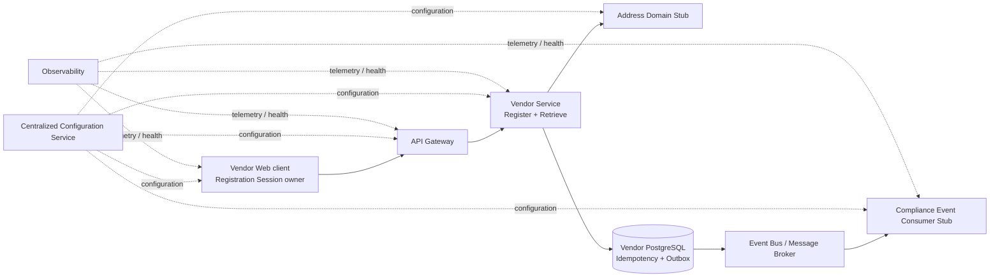

# HJ-010 - Current Application Architectural Concerns

| Field | Value |
|---|---|
| **Document ID** | HJ-010 |
| **Document Title** | Current Application Architectural Concerns |
| **Version** | 2.0 |
| **Status** | Approved |
| **Classification** | Architecture |
| **Owner** | Project Architecture |
| **Last Updated** | 26 August 2026 |

## Revision History

| Version | Date | Description |
|---|---|---|
| 0.1 | 11 August 2026 | First draft, titled *Application Architecture and Implementation Pattern Map*. Established a concern-centric mapping from the System Model and Epic 1 requirements to candidate patterns, DDD classification and ADR navigation. |
| 0.2 | 13 August 2026 | Applied CR-037. Renamed and restructured HJ-010 as the Current Application Architectural Concerns register; reconciled it with HJ-011 v1.1 and HJ-SM-001 v1.0; introduced the Approach, Resolution State, decision provenance, verification treatment and concern lifecycle; and completed the initial Epic 1 concern review. |
| 0.3 | 14 August 2026 | Applied CR-038. Limited Current Architectural Concerns to Exploring, Selected, Blocked and Challenged; separated architectural approval from downstream implementation and testing; added explicit blocker relationships; and renamed the planned architecture test destination to HJ-013. |
| 1.0 | 14 August 2026 | Applied CR-039. Established HJ-010 as the complete architectural concern register; retained Approved concerns; reconciled the first approved architecture batch; established synchronization with HJ-012; and published the first approved baseline. |
| 1.1 | 15 August 2026 | Applied CR-044. Aligned HJ-010 with HJ-107 v1.0 Approved and HJ-013 v1.0 Approved, removed obsolete planned and creation language, and changed no concern, Approach, Resolution State, Priority or verification responsibility. |
| 1.2 | 17 August 2026 | Applied CR-045. Reconciled the approved CON-006–CON-011 Address collaboration and RegisterVendor orchestration decisions. |
| 1.3 | 18 August 2026 | Reconciled the approved CON-012 transport-independent RegisterVendorCommand decision, synchronized with HJ-012 v1.3. |
| 1.4 | 19 August 2026 | Reconciled the approved CON-040 transport-independent `RegisterVendorResult` decision as part of the synchronized HJ-010/HJ-012 v1.4 architecture baseline. |
| 1.5 | 19 August 2026 | Reconciled the approved CON-013 composite Vendor uniqueness identity and semantic registration-equivalence decision as part of the synchronized HJ-010/HJ-012 v1.5 architecture baseline. |
| 1.6 | 21 August 2026 | Reconciled the approved CON-014–CON-016 and CON-028 PostgreSQL-backed concurrency, permanent replay outcome, atomic registration transaction and explicit EF Core mapping cohort as part of the synchronized HJ-010/HJ-012 v1.6 architecture baseline. |
| 1.7 | 22 August 2026 | Applied CR-059. Reconciled the approved CON-019 pre-outbox Integration Event translation and CON-020 VendorRegistered v1 published-contract decisions as part of the synchronized HJ-010/HJ-012 v1.7 architecture baseline. |
| 1.8 | 23 August 2026 | Applied CR-TBD-HJ010. Reconciled the approved amended CON-020 concrete VendorRegistered v1 JSON representation as part of the synchronized HJ-010/HJ-012 v1.8 architecture baseline. |
| 1.9 | 25 August 2026 | Reconciled the approved CON-023–CON-026 Epic 1 HTTP adaptation, technical API contract, controlled failure mapping and validation-allocation cohort as part of the synchronized HJ-010/HJ-012 v1.9 architecture baseline. |

| 2.0 | 26 August 2026 | Reconciled the approved unified Application validation-failure decision for CON-025, CON-026 and CON-040 as part of the synchronized HJ-010/HJ-012 v2.0 architecture baseline. |

## Related Documents

| Document ID | Title | Status | Relationship |
|---|---|---|---|
| HJ-SM-001 v1.0 | System Model | Approved | Defines the approved system and Epic 1 concern-extraction baseline. |
| HJ-001 | Project Vision | Approved | Defines product vision and business scope. |
| HJ-002 | Architectural Principles | Approved | Provides architectural constraints and evaluation criteria. |
| HJ-003 | Ubiquitous Language Guide | Approved | Provides authoritative domain terminology. |
| HJ-004 | Vendor Domain Models | Approved | Defines Vendor behaviour, ownership and consistency boundaries. |
| HJ-005 | Coding Standards | Approved | Governs implementation and technical conventions where applicable. |
| HJ-006 | Testing Strategy and Standards | Approved | Governs test classification, design and quality. |
| HJ-007 | Enforcement Strategy | Approved | Defines enforcement mechanisms for architectural and engineering rules. |
| HJ-011 v1.9 | Epic 1 Vendor Registration Implementation Scope | Approved | Active implementation boundary aligned to the approved CON-023–CON-026 API and validation cohort. |
| HJ-104 | Vendor Registration Information Contract | Approved | Defines registration information, validation and ownership. |
| HJ-105 | Vendor Registration Sequence Diagram | Approved | Defines approved registration and retrieval interactions. |
| HJ-106 | Vendor Registration Service Contract | Approved | Defines RegisterVendor and RetrieveRegisteredVendor business service contracts. |
| HJ-107 v1.6 | Vendor Registration Test Catalogue | Approved | Current approved behavioural-verification catalogue; regeneration is required after CON-023–CON-026 reach HJ-106. |
| HJ-013 v1.8 | Architecture and Implementation Test Catalogue | Approved | Current approved architecture and implementation verification catalogue; regeneration is required after HJ-107. |
| ADR-001 | Domain-Driven Design as the Primary Architectural Style | Accepted | Governs application of DDD patterns. |
| ADR-003 | Event-Driven Collaboration | Accepted | Governs asynchronous bounded-context collaboration. |
| ADR-004 | Vendor Lifecycle Begins After Successful Registration | Accepted | Governs registration lifecycle and Registration Session boundary. |
| ADR-005 | Registered Information vs Vendor Managed Information | Accepted | Governs information classification and ownership. |
| ADR-006 | Address Domain Ownership and Business Address Snapshots | Accepted | Governs Address authority and Vendor snapshot ownership. |
| ADR-007 | Vendor Compliance as a Separate Bounded Context | Accepted | Governs the Vendor-to-Compliance boundary. |
| ADR-008 | Idempotent Operations and Reliable Event Publication | Accepted | Governs RegisterVendor idempotency and reliable publication guarantees. |
| CR-037 | Restructure HJ-010 as the Current Application Architectural Concerns Register | Approved for application | Authorises this revision. |
| CR-038 | Align HJ-010 Concern Resolution and Approval Lifecycle | Approved for application | Authorises the v0.3 concern-resolution and approval lifecycle. |
| CR-039 | Establish Complete Concern Tracking and Publish First Approved Architecture Batch | Applied | Authorises the complete concern lifecycle, first approved batch and v1.0 baseline. |
| HJ-012 v1.0 | Established Application Architecture Patterns | Approved | Authoritative catalogue of approved application architecture and challenged resolutions retained for traceability. |

## 1. Purpose

HJ-010 is the authoritative and complete register of **Application Architectural Concerns** for the active implementation scope. It retains concerns whose Resolution State is **Exploring**, **Selected**, **Blocked**, **Approved** or **Challenged**.

For each concern it records:

- the architectural problem and **Required Guarantee**;
- the source or boundary that creates the concern;
- candidate approaches during exploration and the selected **Approach** after resolution;
- the concern's **Resolution State** and resolution priority;
- the decision, principle, standard, convention or implementation-local authority governing the resolution; and
- the verification treatment for any executable architectural guarantee.

HJ-010 is an architecture-navigation and concern-lifecycle artefact. It does not duplicate ADR rationale, engineering standards or test specifications. HJ-012 is the authoritative catalogue of approved application architecture; HJ-010 remains authoritative for concern identity and current Resolution State.

When one Approach has been selected and approved through the appropriate decision authority, the concern remains in HJ-010 with Resolution State **Approved** and its approved resolution is published in **HJ-012 - Established Application Architecture Patterns**. Implementation and test execution validate conformance with approved architecture; they are not prerequisites for approval.

Known, materially significant concerns outside the active scope belong in a separate Deferred Architectural Concerns register.

HJ-010 does not define C# projects, namespaces, folders or classes before the applicable architectural concerns are sufficiently resolved.

## 2. Current Implementation Baseline

| Field | Baseline |
|---|---|
| **Active Implementation Scope** | Epic 1 - Vendor Registration |
| **Authoritative Scope** | HJ-011 v1.9 |
| **System Model Baseline** | HJ-SM-001 v1.0, Approved |
| **Last Concern Reconciliation** | 23 August 2026 (amended CON-020) |
| **Applicable Sources** | The approved and accepted sources listed in Related Documents, plus HJ-107 as the current downstream behavioural test catalogue |

HJ-010 claims concern completeness only for this baseline. It does not claim completeness for future HotJoes capabilities or future Epics.

## 3. Concern Model and Decision Rules

### 3.1 Concern-Centric Mapping

Each row represents one independently resolvable architectural concern. A component or boundary may appear in several rows where it creates separate guarantees, such as invocation, translation, failure handling and verification.

Verification-only rows are avoided where verification can be expressed more clearly as the **Verification Treatment** of the underlying concern.

### 3.2 Approach

The **Approach** column records patterns, standards, conventions, policies or implementation mechanisms being considered or selected for a concern. An Approach may be a DDD or integration pattern, principle, engineering standard, platform convention, policy, implementation-local mechanism or an explicit decision not to introduce an additional mechanism.

Its use depends on Resolution State:

| Resolution State | Approach Treatment |
|---|---|
| **Exploring** | One or more candidate Approaches may be recorded while the architectural decision is being evaluated. |
| **Selected** | Exactly one chosen Approach is recorded. Its applicable decision authority remains to be completed or approved. |
| **Blocked** | One or more candidate Approaches may remain recorded where known, but selection cannot progress until the identified blockers are resolved. The field may be blank where the blocker prevents responsible candidate identification. |
| **Approved** | Exactly one approved Approach is recorded and must agree with the corresponding HJ-012 entry. |
| **Challenged** | The previously approved Approach and one or more alternatives may be recorded while the resolution is reconsidered. |

Extensive alternative analysis and decision rationale belong in the applicable ADR or supporting architectural discussion rather than in the concern table.

### 3.3 Resolution State

| State | Meaning |
|---|---|
| **Exploring** | One or more candidate Approaches are being evaluated and an architectural selection remains to be made. |
| **Selected** | One Approach has been chosen, but its applicable decision authority has not yet been completed or approved. |
| **Blocked** | Architectural progress depends on one or more explicitly identified concerns or missing authoritative sources. |
| **Approved** | One Approach has received the applicable decision approval and forms part of the application architecture baseline published in HJ-012. |
| **Challenged** | A previously approved resolution has returned for architectural reconsideration because downstream contract generation, test generation or implementation evidence exposed a potential architectural deficiency. |

Decision need is not a lifecycle state. It is recorded under **Decision Treatment / Source**.

A newly added concern enters HJ-010 as **Exploring**. Implementation progress and test results are managed by their owning implementation and test artefacts rather than as HJ-010 Resolution States.

### 3.4 Decision Treatment

DDD classification does not determine ADR necessity. Decision treatment is one of:

- **Existing ADR**;
- **New ADR required**;
- **Architectural Principle**;
- **Engineering Standard**;
- **Established Framework / Platform Convention**;
- **Implementation-local Decision**; or
- **Unresolved**.

The applicable source is recorded alongside the treatment. A new ADR is required only when a decision is architecturally significant and warrants durable capture of its rationale and consequences. HJ-010 does not create ADRs merely to complete the table.

For a Selected concern, Decision Treatment / Source identifies the authority still requiring completion or approval. For a Blocked concern, it identifies the blocking `CON-xxx` concerns and/or missing authoritative sources. No separate dependency column is used.

Every Approved concern has one corresponding HJ-012 entry with matching architectural data. A previously Approved concern that becomes Challenged remains represented in HJ-012 as Challenged, but that entry is not active implementation authority while reconsideration is managed in HJ-010.

### 3.5 Priority

| Priority | Meaning |
|---|---|
| **P0** | Blocks or materially risks the executable Epic 1 path; resolve before dependent implementation. |
| **P1** | Required for Epic 1 completion but can follow the blocking architecture. |
| **P2** | Required assurance or delivery concern that can be completed after the primary runtime path is established. |

### 3.6 Verification Rule

> **Every Current Architectural Concern shall identify its authoritative source, resolution provenance and verification treatment. Every executable architectural guarantee shall identify at least one verification destination.**

Verification may be provided through HJ-107, **HJ-013 - Architecture and Implementation Test Catalogue**, static analysis, build enforcement, deployment/configuration validation, runtime evidence, code review or architecture review. HJ-010 references the destination; it does not copy the underlying test case.

## 4. Epic 1 Concern-Extraction Boundary

The current concern set covers the complete executable boundary established by HJ-011 v1.9 and HJ-SM-001 v1.0:



This is a concern-extraction view derived from HJ-SM-001 v1.0, not a replacement System Model.

For Epic 1:

- the Web client owns the transient Registration Session;
- BFF implementation is out of scope;
- the Address capability and Compliance consumer are controlled stubs behind their intended boundaries;
- the API Gateway, PostgreSQL persistence, real Event Bus / Message Broker and centralized configuration are in scope;
- security and sufficient observability are in scope;
- feature-management behaviour and a dedicated Identity capability are out of scope; and
- Registered Vendor retrieval is part of the executable slice.

## 5. Current Architectural Concerns

| ID | Architectural Concern | Required Guarantee | Scope / Source | Approach | Resolution State | Priority | Decision Treatment / Source | Verification Treatment |
|---|---|---|---|---|---|---|---|---|
| CON-001 | Vendor consistency boundary | Vendor creation and lifecycle invariants are protected within one consistency boundary. | HJ-004; ADR-001 | Aggregate | Approved | P0 | Existing ADR: ADR-001; HJ-004 | HJ-107 domain/application tests; HJ-013 aggregate-boundary tests; architecture review. |
| CON-002 | Identity-free business concepts | Immutable or identity-free domain concepts are explicit and do not degrade into primitive obsession. | HJ-003; HJ-004; HJ-005 | Value Object | Approved | P1 | Existing ADR: ADR-001; Engineering Standard: HJ-005 | HJ-107/domain unit tests; HJ-013 value-object implementation tests; architecture/code review. |
| CON-003 | Vendor identity and lifecycle state | Vendor identity persists while lifecycle-bearing state changes through valid domain behaviour. | HJ-004; ADR-004 | Entity | Approved | P0 | Existing ADRs: ADR-001, ADR-004 | HJ-107 lifecycle/creation tests; HJ-013 entity identity and boundary tests. |
| CON-004 | Registration business fact | Successful registration raises an internal business fact without coupling the Domain Model to external messaging. | HJ-004; HJ-105; ADR-008 | Domain Event | Approved | P0 | Existing ADRs: ADR-003, ADR-008 | HJ-107 event/no-event behavioural tests; HJ-013 Domain Event isolation tests; architecture review. |
| CON-005 | Aggregate persistence abstraction | Vendor persistence and retrieval do not introduce persistence concerns into the Domain Model. | HJ-004; HJ-005 | Repository | Approved | P0 | Existing ADR: ADR-001; Engineering Standard: HJ-005 | HJ-013 repository contract, persistence integration and dependency-direction tests. |
| CON-006 | Vendor-to-Address dependency direction | Address remains authoritative and Vendor depends only on an application-facing boundary, not an Address implementation or stub. | HJ-SM-001; HJ-011 §4.1; ADR-006 | Vendor application port + Address adapter; Anti-Corruption Layer | Approved | P0 | Approved under ADR-006. The Vendor Application depends on an application-facing Address Resolution port. Concrete Address Domain integration and the Epic 1 Address stub are implemented as adapters outside the Vendor Domain. Address-owned representations are translated through an Anti-Corruption Layer. | HJ-013 dependency-direction and architecture tests; Address port contract tests; adapter integration tests; architecture review confirming that the Vendor Domain has no dependency on an Address implementation or stub. |
| CON-007 | Address capability invocation | Registration can resolve authoritative Address information synchronously without invocation mechanics entering domain behaviour. | HJ-105; HJ-106 Part A; HJ-011 §4.1 | Synchronous typed Address Resolution through the Vendor application port and Address adapter | Approved | P0 | Approved application-boundary decision under ADR-006. The Vendor Application resolves the submitted opaque Address Resolution reference synchronously through its typed Address port. Invocation mechanics remain in the concrete adapter and do not enter Vendor Domain behaviour. | Address port contract tests; adapter integration tests; Vendor Application orchestration tests; HJ-107 observable Address-resolution outcomes after upstream propagation; architecture tests confirming that invocation mechanics do not enter the Vendor Domain. |
| CON-008 | Address contract translation | Address-owned concepts are translated by the Address adapter into the Vendor’s immutable BusinessAddressSnapshot, CanonicalAddressId and regulatory-authority values without foreign-model leakage or Vendor-side derivation. | HJ-004; HJ-104; HJ-106; ADR-006 | Explicit Address adapter mapper/translator forming the Vendor Anti-Corruption Layer | Approved | P0 | Approved under ADR-006. The Address adapter translates the complete authoritative Address result into Vendor Domain values without exposing the Address Domain representation. It creates the immutable BusinessAddressSnapshot containing optional RecipientOrOrganisationName, required AddressLine1, optional AddressLine2 and AddressLine3, required PostTown and Postcode, and optional County. It also translates CanonicalAddressId, FoodRegistrationAuthority and conditional PrimaryTradingAuthority. The Vendor Domain does not parse, derive, normalise or replace Address-owned information. | HJ-013 Address adapter mapping and Anti-Corruption Layer tests; Address contract tests; BusinessAddressSnapshot immutability and exact-value tests; HJ-107 observable snapshot and authority outcomes after upstream propagation. |
| CON-009 | Address Resolution reference contract | Vendor Registration accepts only a permanent opaque Address Resolution reference issued for a complete authoritative Address result bound to the declared Trading Location. Repeated resolution deterministically returns the original immutable result, and a mismatched Trading Location context is rejected. | HJ-004; HJ-104; HJ-105; HJ-106; ADR-006 | Permanent opaque Address Resolution reference bound to an immutable Address result and declared Trading Location | Approved | P0 | Approved consumed Address contract under ADR-006. A reference is issued only after the Address Domain has produced a complete valid result for the declared Trading Location. It is permanent, opaque, reusable, non-consuming, has no expiry or revocation, and binds the original immutable CanonicalAddressId, BusinessAddressSnapshot and regulatory-authority values. Unknown or fabricated references return InvalidReference. A reference used with a different Trading Location, or a known selection unable to satisfy the required context, returns InvalidAddressResult. | Address consumed-contract tests; client Address-selection and progression tests; Vendor Application reference-resolution tests; Trading Location binding tests; immutable repeated-resolution tests; HJ-107 behavioural tests and HJ-013 adapter/contract tests after upstream propagation. |
| CON-010 | Address failure and resilience | Vendor Registration deterministically handles invalid Address references, invalid contextual Address results and technical Address unavailability without partial Vendor creation, unsafe retry or leakage of Address implementation details. | HJ-105; HJ-106; HJ-011 §4.1 | Fail fast for semantic Address failures; no in-process automatic retry for technical failures; controlled retryable application failure | Approved | P0 | Approved following CON-009. InvalidReference and InvalidAddressResult fail fast and prevent Vendor creation. Address timeout, unavailability or transient invocation failure produces a controlled retryable Vendor Application failure with no in-process automatic retry. The caller may retry RegisterVendor using the same permanent Address Resolution reference. No circuit breaker is introduced for Epic 1. | Vendor Application tests for InvalidReference and InvalidAddressResult; timeout and unavailability failure-injection tests; assertions that Vendor creation, Domain Events, persistence and publication work do not occur; safe caller-retry tests; HJ-107 observable failure outcomes and HJ-013 adapter resilience tests after upstream propagation. |
| CON-011 | RegisterVendor orchestration | The application layer coordinates registration without moving domain rules into transport or infrastructure code. | HJ-004; HJ-105; HJ-106 | Vendor Application Service orchestrating the RegisterVendor use case | Approved | P0 | Approved application-layer decision governed by HJ-005, HJ-004, HJ-105 and HJ-106. The Vendor Application Service coordinates request validation, synchronous Address Resolution through the application port, Vendor aggregate creation, persistence and the approved reliable-publication boundary. Domain rules remain in the Vendor Domain; transport and infrastructure mechanics remain outside the application use case. | Vendor Application orchestration tests; collaborator and prohibited-call assertions; architecture tests confirming dependency direction and absence of Domain-rule duplication; HJ-107 RegisterVendor behavioural tests after upstream propagation. |
| CON-012 | Registration intent representation | A complete Vendor Registration intent is represented independently of HTTP request models and client/BFF Registration Session state, without containing an already-created Vendor or client-authoritative Address-owned values. | HJ-104; HJ-105; HJ-106 §§4.1–4.3; ADR-004; ADR-006; ADR-008 | Immutable transport-independent `RegisterVendorCommand` owned by the Vendor Application | Approved | P0 | Approved application-boundary decision. The command carries all client-authored registration fields, the opaque Address Resolution reference and transient declarations. Address-owned, Domain-generated, persistence and publication values are excluded. Idempotency mechanics remain under CON-013–CON-016. | Application unit tests for complete command retention, transport independence, Address-owned-field exclusion and RegisterVendor orchestration; architecture enforcement remains subject to CON-037. |
| CON-013 | Idempotency identity and request equivalence | Epic 1 identifies an existing Vendor registration by trimmed, case-insensitive Trading Name plus trimmed, case-insensitive Legal Operator Name plus CanonicalAddressId. An equivalent repeated submission returns the original committed result; the same identity with materially different registration information returns IdempotencyConflict and never updates the Vendor. | HJ-004; HJ-104; HJ-106 §§4.8–4.10; ADR-008; HJ-107 VR-BLOCKED-005 | Composite Vendor uniqueness identity + deterministic semantic registration fingerprint | Approved | P0 | Approved Application and persistence-boundary decision. Vendor uniqueness identity comprises trimmed, case-insensitive TradingName, trimmed, case-insensitive LegalOperatorName and CanonicalAddressId. Semantic equivalence compares the complete materially relevant registration information after its approved canonicalisation, excluding transient Registration Declarations, the opaque Address Resolution reference, server-generated values and technical metadata. Equivalent replay returns the original committed successful result without repeating any business effect. The same identity with different material information returns IdempotencyConflict and does not update the Vendor. Vendor updates require a separate future administration operation. CON-014–CON-016 and CON-028 govern concurrency, replay persistence, transaction and database mechanics. | Application tests for trimmed and case-insensitive identity matching, equivalent replay, materially different conflict and absence of update or repeated business effects. CON-014, CON-015, CON-016 and CON-028 provide separate concurrency, persisted replay, atomicity and database-constraint evidence. |
| CON-014 | Concurrent duplicate coordination | Concurrent equivalent or conflicting submissions cannot create duplicate Vendors, outcomes, facts or publication work. | ADR-008; HJ-105; HJ-106 | PostgreSQL composite-identity uniqueness constraint + transaction-coordinated duplicate resolution | Approved | P0 | Approved persistence-boundary decision. PostgreSQL is the concurrency authority for RegisterVendor. A database-enforced unique constraint over the approved normalized composite Vendor identity permits only one Vendor registration to commit. A competing submission that loses the uniqueness race commits no business effect and, after the winning transaction completes, loads the committed registration record. Semantically equivalent information returns the original committed successful result; materially different information returns IdempotencyConflict. No process-local lock, distributed lock or separate request-coordination service is used. ADR-008 amendment required. | Real-PostgreSQL concurrent-submission tests prove that equivalent and conflicting races converge on one Vendor, one persisted successful outcome and one outbox item. Losing transactions create no Vendor, Domain Event, publication work or other business effect. |
| CON-015 | Idempotency outcome persistence and replay | A qualifying retry returns the original committed outcome without re-executing the business operation; retention is explicit. | ADR-008; HJ-106; HJ-107 VR-BLOCKED-005 | Permanent persisted registration outcome + versioned deterministic semantic fingerprint | Approved | P0 | Approved Application and persistence-boundary decision. Each successful registration persists the original RegisterVendor Application result and a SHA-256 fingerprint calculated from a versioned deterministic UTF-8 canonical representation of the materially relevant registration information defined by CON-013. The persisted representation excludes transient Registration Declarations, the opaque Address Resolution reference, server-generated values and technical metadata. The outcome does not expire and is retained for at least as long as the Vendor registration exists; Epic 1 provides no deletion or expiry operation. Equivalent replay returns the persisted original result and does not reconstruct it from the Vendor’s current lifecycle state. ADR-008 amendment required. | Persistence integration tests prove deterministic fingerprinting, permanent retention, faithful original-result replay after Vendor lifecycle state changes, equivalent replay without repeated effects and conflict for materially different information. |
| CON-016 | Registration transaction boundary | Vendor creation, idempotency outcome and durable publication obligation have an explicit atomic boundary. | HJ-011 §§2.4-2.5; HJ-105; ADR-008 | One explicit PostgreSQL transaction coordinated by the Vendor Application and implemented by Infrastructure | Approved | P0 | Approved transaction-boundary decision. One PostgreSQL transaction atomically commits the Vendor Aggregate and Registered Information, the persisted idempotency identity, semantic fingerprint and original successful result, and exactly one durable outbox item for the genuine VendorRegistered occurrence. Any failure before commit leaves none of these committed. Address resolution and pre-transaction validation occur before the transaction begins. Outbox dispatch occurs after commit and outside the registration transaction. The Vendor Application owns orchestration of the boundary; EF Core and PostgreSQL mechanics remain in Infrastructure. ADR-008 amendment required. | Real-PostgreSQL failure-injection and transaction tests prove atomic commit and rollback across Vendor, registration outcome and outbox persistence. Tests prove that dispatch failure does not roll back registration and that pre-commit failure leaves no partial state. |
| CON-017 | Reliable publication staging | A committed Vendor cannot lose the obligation to publish VendorRegistered. | HJ-011 §2.5; ADR-008 | Transactional Outbox | Approved | P0 | Existing ADR: ADR-008 | HJ-107 publication outcomes; HJ-013 atomicity, failure-injection and recovery tests. |
| CON-018 | Outbox relay and recovery | Publication runs independently of the synchronous response, retries safely and exposes stalled/failed work for recovery. | HJ-011 §§2.5, 2.8; ADR-008 | Polling publisher; CDC relay; broker-integrated relay | Exploring | P0 | Existing ADR: ADR-008 for guarantees; unresolved mechanism, new ADR assessment required | Relay retry/restart/backoff/failure tests; outbox diagnostics and health verification. |
| CON-019 | Domain Event to Integration Event translation | Internal VendorRegistered business facts remain separate from the external versioned contract, are translated before outbox persistence and are never reconstructed by the relay from current Vendor state. | HJ-004; HJ-106; ADR-003; ADR-008; CON-020 | Vendor Application-owned explicit mapper translating VendorRegistered before outbox persistence | Approved | P0 | Approved Decision Mode resolution, 22 August 2026; ADR-003 and ADR-008. An explicit Vendor Application-owned mapper translates VendorRegistered into the approved versioned Integration Event before outbox persistence. Vendor Infrastructure serializes and persists the resulting event unchanged within the registration transaction. Domain code contains no Integration Event, outbox, serialization or broker representation. Relay-time reconstruction from current Vendor state is prohibited. | Application mapper tests prove exact Domain-to-Integration translation and exclusions. Architecture tests prove that Integration Event, outbox, serialization and broker types remain outside the Vendor Domain. Persistence integration tests prove that the translated serialized event is stored unchanged and is not reconstructed from later Vendor state. |
| CON-020 | Integration Event schema and compatibility | VendorRegistered has an approved Vendor-owned versioned payload, independent Business Address representation, stable envelope, exact JSON member structure and deterministic wire-format rules sufficient to initiate Pending Activation and Compliance processing without synchronous Vendor retrieval. | HJ-004; HJ-106; CR-019; HJ-107 VR-BLOCKED-002; CON-019 | Vendor-owned transport-independent VendorRegistered Integration Event v1 contract serialized once as immutable UTF-8 camel-case JSON using contract-owned representations, explicit nulls and deterministic identifier, timestamp, time and enum formats | Approved | P0 | Approved amended Decision Mode resolution, 23 August 2026. Version 1 uses the concrete camel-case JSON envelope and nested payload representation approved through the Slice 8C.3 finding. EventId and VendorId use lowercase canonical UUID D format. OccurredAt and RegisteredAt are converted to UTC and serialized using invariant round-trip O format. Time-only values use invariant HH:mm:ss without an offset. Enum values use lower-camel-case strings matching the approved ubiquitous terms. TradingCharacteristics and OpeningHours use the approved nested object structure. The Integration Event contract owns all published representations and does not expose Vendor Domain Aggregate, Value Object or enum types. Optional members are always present and represented as explicit null when absent. The event is serialized once before outbox persistence and published unchanged. Compatible optional additions are permitted within v1; removal, renaming, type or meaning changes require a new version. Retries preserve EventId, version and the original serialized event. Consumers tolerate unknown fields. | Integration contract and serialization tests prove the exact v1 envelope, nested payload, member names and ordering-independent JSON structure; lowercase canonical UUID D identifiers; UTC invariant round-trip O timestamps; invariant HH:mm:ss time-only values; lower-camel-case enum strings; contract-owned representations; independent BusinessAddress schema; conditional authority; explicit-null optional members; and prohibited-field exclusions. Compatibility tests permit unknown and newly added optional fields while rejecting breaking v1 changes. Persistence and retry tests prove that EventId, version and serialized event remain unchanged and that downstream processing requires no synchronous Vendor lookup. |
| CON-021 | Broker delivery semantics | Message identity, retry, duplicate delivery, ordering assumptions and poison-message treatment preserve the required publication outcome. | HJ-SM-001; HJ-011 §2.5; ADR-003; ADR-008 | At-least-once delivery + idempotent consumer; retry/dead-letter policy | Exploring | P0 | Existing ADRs: ADR-003, ADR-008 for broad guarantees; broker policy unresolved and ADR assessment required | Broker integration, duplicate-delivery, poison-message and recovery tests in HJ-013 Architecture and Implementation Test Catalogue. |
| CON-022 | Compliance consumer stub boundary | The stub proves receipt, deserialization and required payload presence without introducing Compliance business behaviour. | HJ-011 §4.2; ADR-007 | Thin event-consumer adapter + receipt store/probe | Exploring | P1 | Existing ADR: ADR-007 for boundary; implementation-local mechanism unless broader significance emerges | End-to-end broker/consumer tests; receipt observability; architecture review preventing Compliance model creation. |
| CON-023 | Register and retrieve HTTP adaptation | Both operations are exposed without allowing transport semantics or DTOs to become domain semantics. | HJ-011 §2.3; HJ-106 Part B | Thin ASP.NET Core Minimal API endpoint adapters | Approved | P1 | Approved combined Epic 1 API and Validation Cohort decision. `POST /vendors` invokes `RegisterVendor` and `GET /vendors/{vendorId}` invokes `RetrieveRegisteredVendor`. Thin endpoint adapters own HTTP binding, structural request validation, API-to-Application mapping, Application-result-to-HTTP mapping, cancellation-token forwarding and boundary-specific headers. They contain no Domain rules, Address resolution, persistence query, transaction, event, outbox or broker behaviour. No collection, search, filtering, paging, update or API-versioning capability is introduced in Epic 1. | Endpoint mapping and integration tests for `POST /vendors` and `GET /vendors/{vendorId}`; cancellation and header-forwarding tests; architecture tests proving transport DTO and HTTP concerns remain outside the Application and Domain layers; prohibited-call tests for Domain, Address, persistence, transaction, event, outbox and broker behaviour within endpoints. |
| CON-024 | Technical API contract | Routes, OpenAPI ownership, schemas, headers, serialization, null handling, enums, dates and response representations are approved and consistent. | HJ-106 Part B; HJ-107 VR-BLOCKED-006 | Explicit Epic 1 HTTP and JSON contract with generated OpenAPI description | Approved | P0 | Approved combined Epic 1 API and Validation Cohort decision. The API uses `application/json`, lower-camel-case JSON members and enum strings, lowercase canonical UUID `D` response values, UTC invariant round-trip `O` timestamps and `HH:mm:ss` time-only values. Optional response members are present as explicit `null`; omitted and `null` optional request members both mean absence; unknown request members are ignored. `POST /vendors` accepts the approved nested HJ-106 registration representation. First success and equivalent replay return `201 Created` with VendorId, PendingActivation VendorState and `Location: /vendors/{vendorId}`. `GET /vendors/{vendorId}` returns `200 OK` with the complete approved Registered Vendor Details representation. No caller-supplied idempotency key or custom correlation convention is introduced. | OpenAPI/schema and API contract tests covering routes, media type, required-member presence, nested request and response shapes, explicit-null handling, compatible unknown members, enum and identifier formats, UTC timestamp and time-only formats, `201` registration responses, Location headers and `200` retrieval responses. |
| CON-025 | Business failure and HTTP mapping | Expected business failures use safe typed outcomes, a controlled error envelope and approved transport/status mappings. | HJ-005; HJ-106 §§4, 6.4-6.5; HJ-107 VR-BLOCKED-007 | API-owned error envelope + centralized typed Application-outcome-to-HTTP mapping | Approved | P0 | Approved combined Epic 1 API and Validation Cohort decision, as amended by the unified validation-failure decision. Every Application validation failure returns one `RequestValidationFailure` containing all independently detectable validation errors. The API maps this outcome to `400 Bad Request` using the API-owned client-safe envelope with top-level code `registrationValidationFailed`. Each validation entry contains its API JSON-path field, stable code and client-safe message. Approved validation codes are `required`, `invalidFormat`, `lengthOutOfRange`, `invalidValue`, `conditionallyRequired` and `prohibited`. `RegistrationDeclarationFailure` and `ConditionalRuleFailure` are not separate Application or API outcomes. `validationErrors` is always present and is `null` for failures to which validation details do not apply. Malformed requests and invalid-Address or Aggregate-invariant failures map to `400`; VendorNotFound to `404`; IdempotencyConflict to `409`; temporary Address unavailability and persistence or atomic-recording failure to `503`; and unexpected failure to `500`. Epic 1 does not use `422`. Unexpected exceptions are handled centrally without leaking internal details. | API mapping tests for every approved Application outcome and HTTP status/error code; tests proving every Application validation failure maps to one `registrationValidationFailed` response containing all independently detectable validation entries; validation-envelope and JSON-path tests; assertions that `validationErrors` is always present and `null` when not applicable; proof that no separate `RegistrationDeclarationFailure`, `ConditionalRuleFailure`, `registrationDeclarationFailed` or `conditionalRuleFailed` outcome remains; malformed-request tests; unexpected-exception handling, logging and information-leakage tests; explicit verification that Epic 1 emits no `422` response. |
| CON-026 | Validation allocation | Client, transport, application and Domain validation responsibilities are explicit without weakening or duplicating authoritative business rules. | HJ-004; HJ-005; HJ-104; HJ-106; HJ-011 §§2.2-2.3 | API structural validation + authoritative Vendor Application validation and canonicalisation + defensive Domain invariants | Approved | P0 | Approved combined Epic 1 API and Validation Cohort decision, as amended by the unified validation-failure decision. The API owns only HTTP and wire-structure validation. Before Address resolution, identity or fingerprint determination and Aggregate creation, the Vendor Application authoritatively validates all HJ-104 field, Registration Declaration, conditional and cross-field rules. Any Application validation failure returns one `RequestValidationFailure` containing every independently detectable validation error; declaration and conditional-rule failures are validation entries rather than separate top-level outcomes. Successful validation produces canonical values used by every downstream stage. The Vendor Domain remains the final defensive owner of Aggregate and Value Object invariants. Approved canonicalisation includes uppercase Company Registration Number, trimmed and case-insensitive uniqueness-name comparison without replacing registered display values, trimmed Contact Email with preserved local-part case and lowercase domain, and canonical `+44` telephone storage. The approved ASCII Contact Email profile and pragmatic UK telephone structural rule apply. Email and telephone allocation, activity, deliverability, reachability and ownership verification are outside Epic 1. Every pre-commit failure produces no business effect. | Boundary-specific validation tests proving API structural ownership; direct Application validation without HTTP; aggregation of request-field, Registration Declaration, conditional and cross-field errors into one `RequestValidationFailure`; preservation of the approved validation-entry codes; approved Contact Email and Primary Contact Telephone rules and canonicalisation; validation before Address and persistence work; downstream use of canonical values; defensive Domain invariants; and absence of Vendor, event, outcome or outbox effects after any pre-commit failure. |
| CON-027 | Registered Vendor retrieval | Retrieval loads the persisted aggregate as authoritative source, maps a purpose-specific response, is side-effect-free and returns controlled Not Found. | HJ-004; HJ-105; HJ-106 §4.12; HJ-011 | Query handler + Repository + response mapper | Approved | P1 | Existing ADR: ADR-001; approved HJ-004/HJ-106 contract; implementation-local handler style | HJ-107 VR-RETRIEVE tests; HJ-013 repository and mapping integration tests. |
| CON-028 | PostgreSQL mapping and constraints | Aggregate state, registered information, idempotency and outbox data are explicitly mapped with correct keys, constraints, indexes and delete behaviour. | HJ-005; HJ-011 §2.4; ADR-008 | Explicit EF Core fluent mapping + PostgreSQL keys, constraints and indexes | Approved | P0 | Approved persistence implementation decision. Vendor Infrastructure owns explicit EF Core fluent mappings for the Vendor Aggregate, Registered Information, persisted registration outcome and outbox data. Mappings define keys, lengths, nullability, conversions, enum representations, indexes and restrictive delete behaviour. Persisted normalized Trading Name and Legal Operator Name together with CanonicalAddressId form a database-enforced unique constraint. A one-to-one registration-outcome record retains the semantic fingerprint and original RegisterVendor result. Registration Declarations and the opaque Address Resolution reference are not persisted as Vendor state. No cascade deletion of registration outcomes or outbox records is permitted. CON-029 separately governs schema migrations; CON-018–CON-021 govern outbox contract, relay and delivery details. | Real-PostgreSQL tests prove complete Aggregate round-trip and rehydration, value conversion and nullability fidelity, composite uniqueness enforcement, registration-outcome persistence, restrictive delete behaviour, outbox persistence, required indexes and transaction atomicity. Migration lifecycle evidence remains under CON-029. |
| CON-029 | Schema migration lifecycle | Epic 1 schema changes are repeatable, ordered, deployment-safe and verified against supported database states. | HJ-011 §2.4; HJ-005; HJ-007 | Versioned migrations + automated migration validation | Exploring | P1 | Engineering/Enforcement Standards: HJ-005, HJ-007; tooling choice unresolved | Clean-build and upgrade migration tests; CI/deployment validation. |
| CON-030 | API Gateway boundary | Gateway routing/version forwarding, validation allocation, error propagation and correlation forwarding do not duplicate domain/application responsibilities. | HJ-SM-001; HJ-011 §2.3 | Thin reverse-proxy/gateway configuration; explicit route policy | Exploring | P1 | Architectural Principles: HJ-002; platform/implementation decision unresolved | Gateway routing, TLS, header/correlation and failure propagation integration tests. |
| CON-031 | Web client Registration Session | The Web client alone owns transient registration state, disposes it after success/abandonment and submits a complete self-contained request. | HJ-011 §2.2; HJ-105; ADR-004; ADR-008 | Client-side session state + explicit submit/retry workflow | Exploring | P1 | Existing ADRs: ADR-004, ADR-008 for boundary; client mechanism unresolved | Client journey/state tests; HJ-107 VR-REQ-001, VR-SCOPE-001 and retry behaviour. |
| CON-032 | Centralized configuration | In-scope components obtain and validate environment-appropriate non-secret configuration consistently, with explicit bootstrap, refresh and failure behaviour. | HJ-SM-001; HJ-011 §2.6; CR-036 | Central configuration provider/client; startup validation; cached/fail-fast policy | Exploring | P0 | New ADR assessment required due cross-component/product-level effect; feature management excluded | Configuration bootstrap, validation, outage and environment-separation tests in HJ-013 Architecture and Implementation Test Catalogue. |
| CON-033 | Secret and credential management | Centralized configuration cannot expose secrets; credentials are retrieved, protected, rotated and excluded from logs/configuration output. | HJ-011 §§2.6-2.7; HJ-002; HJ-005 | Dedicated secret provider + configuration references; secure runtime injection | Exploring | P0 | Architectural Principle/Engineering Standard: HJ-002, HJ-005; platform selection unresolved | Secret scanning, configuration/log leakage checks and deployment validation. |
| CON-034 | Transport and registration-data protection | External endpoints use HTTPS and registration information is protected against unauthorised modification or disclosure with secure defaults. | HJ-011 §2.7; HJ-SM-001 | TLS termination and trusted forwarding; encryption/platform controls; log redaction | Exploring | P0 | Architectural Principles: HJ-002; platform convention and deployment decision unresolved | TLS/gateway tests, security configuration validation, sensitive-data redaction tests and review. |
| CON-035 | Correlation and observability | Registration, persistence, idempotency, outbox publication and consumer receipt can be correlated and diagnosed without leaking sensitive data. | HJ-SM-001; HJ-011 §2.8; HJ-005 | Structured logs + correlation context + traces/metrics where required | Exploring | P1 | Engineering Standard: HJ-005; cross-component observability convention unresolved | End-to-end correlation tests; telemetry/redaction review; failure-diagnosis scenarios. |
| CON-036 | Health and readiness | Each deployable exposes health/readiness evidence that distinguishes process health from unavailable required dependencies. | HJ-SM-001; HJ-011 §2.8 | Liveness/readiness checks + dependency-specific health contributors | Exploring | P1 | Established platform convention or Engineering Standard to be selected | Health/readiness integration and orchestration tests. |
| CON-037 | Dependency composition and enforcement | Concrete adapters are composed at application edges and forbidden Domain/Application dependencies fail automated enforcement. | HJ-002; HJ-005; HJ-007; solution boundaries | Composition Root + dependency injection + architecture fitness tests | Exploring | P1 | Architectural Principles/Engineering Standards: HJ-002, HJ-005, HJ-007; local composition style unresolved | Architecture fitness tests, static analysis and build enforcement. |
| CON-038 | Runtime and deployment composition | Epic 1 deployables, dependencies, startup/readiness ordering and local/integration environments form a reproducible executable completion boundary. | HJ-SM-001; HJ-011 §5; HJ-007 | Declarative service composition + health-gated startup; automated environment provisioning | Exploring | P1 | New ADR assessment if deployment topology constrains product architecture; otherwise engineering/platform decision | Environment smoke tests, end-to-end Epic 1 test, deployment and readiness validation. |
| CON-039 | CI quality and architectural controls | Required tests, analysis and architecture rules run consistently and prevent non-conforming changes from progressing. | HJ-005; HJ-006; HJ-007 | CI quality gates + static analysis + test classification/enforcement | Exploring | P2 | Engineering/Enforcement Standards: HJ-005, HJ-006, HJ-007 | Pipeline evidence, deliberate rule-violation tests and architecture review. |
| CON-040 | RegisterVendor application outcome representation | RegisterVendor returns a closed, transport-independent typed outcome that distinguishes committed success from every expected controlled failure without exposing HTTP, framework, Address implementation or persistence details. Every Application validation failure is represented by one `RequestValidationFailure` containing all independently detectable validation errors. | HJ-005 §§7.4, 12.1; HJ-106 §§4.7, 4.9, 4.11; CON-011 | Closed typed `RegisterVendorResult` owned by the Vendor Application | Approved | P0 | Approved Application-boundary decision, as amended by the unified validation-failure decision. Success carries the minimum committed Vendor identity and state. Expected failures use stable Application-owned outcome kinds. All request-field, Registration Declaration, conditional and cross-field validation failures use one `RequestValidationFailure` containing every independently detectable validation error. `RegistrationDeclarationFailure` and `ConditionalRuleFailure` are removed from the closed outcome set. HTTP representation and status mapping are governed by approved CON-024 and CON-025. | Application unit tests for closed result construction, success and failure state validity, one immutable aggregated `RequestValidationFailure`, preservation of all independently detectable validation entries, absence of separate `RegistrationDeclarationFailure` and `ConditionalRuleFailure` outcome kinds, exact Address failure preservation, absence of transport or infrastructure types, and RegisterVendor orchestration outcome mapping. |

## 6. Resolution Priorities and Dependencies

The order of resolution follows the dependencies and failure risk of the executable Epic 1 path rather than concern ID order.

### 6.1 P0 blocking decisions

1. Approve the consumed Address contract and failure taxonomy (`CON-009`, `CON-010`), then resolve the Address port, adapter and translation (`CON-006`-`CON-008`).
2. Implement the approved HTTP adaptation, technical API contract, error mapping and validation allocation (`CON-023`–`CON-026`).
3. Implement the approved idempotency identity, concurrency, permanent outcome storage, transaction and PostgreSQL constraint cohort (`CON-013`–`CON-016`, `CON-028`).
4. Approve the Integration Event contract and resolve outbox relay and broker delivery policies (`CON-017`-`CON-021`).
5. Select the centralized-configuration and secret-management approach (`CON-032`, `CON-033`).
6. Establish the required security boundary and runtime data protection (`CON-034`).

### 6.2 P1 completion architecture

After the blocking contracts and transactional path are stable, resolve the Compliance Stub, migrations, Gateway, Web client, observability, health, dependency enforcement and runtime composition.

### 6.3 P2 assurance

Complete and enforce CI quality controls once the required suites and architecture rules have concrete destinations.

Priority determines the order in which Current Architectural Concerns should be explored, unblocked, selected and taken through the applicable decision authority. It does not select an Approach.

## 7. Verification Architecture

HJ-107 remains the Vendor Registration behavioural test catalogue derived from HJ-106 and its approved business/domain sources. HJ-010 may reference HJ-107 where an architectural concern has externally observable Vendor Registration behaviour, but HJ-107 is not responsible for every architecture, integration, infrastructure or runtime obligation.

Architecture-specific guarantees are catalogued in **HJ-013 - Architecture and Implementation Test Catalogue** or verified through another explicitly governed mechanism. HJ-010 identifies the verification destination without defining the test specification.

The same higher-level guarantee may require complementary verification without duplicating a test obligation. For example:

- HJ-107 verifies that a qualifying idempotent replay creates no second Vendor;
- architecture verification proves the database concurrency and transaction mechanism that preserves that outcome;
- HJ-107 verifies the required publication outcome; and
- architecture verification proves outbox atomicity, relay retry and broker recovery.

The downstream flow is:

```text
Approved architecture
    -> assess and regenerate HJ-106 where observable service behaviour is affected
    -> independently regenerate HJ-107 where its authoritative inputs materially change
    -> independently regenerate HJ-013 where its authoritative inputs materially change
    -> generate implementation
    -> execute HJ-107 and HJ-013 tests
```

## 8. Concern Lifecycle and Scope Reconciliation

The normal lifecycle is:

```text
Deferred Architectural Concern
    -> Exploring in HJ-010
    -> Selected in HJ-010
    -> applicable decision authority completed
    -> Approved in HJ-010
    -> approved resolution added to HJ-012
```

Challenge follows:

```text
Approved in HJ-010 and HJ-012
    -> architectural deficiency identified
    -> Challenged in HJ-010 and HJ-012
    -> reconsider and complete applicable decision authority
    -> Approved in HJ-010 and updated in HJ-012
```

An Approved concern remains in HJ-010. Not every concern requires a new ADR; the required authority depends on architectural significance. Implementation and passing tests are downstream conformance evidence rather than prerequisites for approval.

A previously approved resolution becomes **Challenged** only when evidence indicates that the architectural guarantee is insufficient, contradictory or ambiguous, correct downstream contracts or tests cannot be derived, or the approved Approach cannot fulfil its Required Guarantee under the applicable constraints. An ordinary implementation defect does not challenge the architecture.

At the beginning of each Epic or material implementation-scope change, Project Architecture shall:

1. update the active implementation baseline;
2. check the new scope against the Current Architectural Concerns;
3. reassess applicable established patterns against new forces;
4. promote applicable Deferred Architectural Concerns into HJ-010 as Exploring;
5. add genuinely new concerns as Exploring;
6. retain all concerns applicable to the active scope, including Approved concerns;
7. verify that every Approved concern has exactly one corresponding Approved HJ-012 entry;
8. verify that every previously approved Challenged concern remains represented in HJ-012 as Challenged;
9. add newly approved resolutions to HJ-012 and update challenged resolutions when re-approved;
10. defer concerns no longer required by the active scope but still materially significant;
11. supersede or remove obsolete concerns only through an explicit reconciliation decision; and
12. record the reconciliation.

HJ-010 shall not accumulate permanent Epic 1, Epic 2 or later-Epic sections. Version control and ADR histories provide historical traceability.

## 9. Deferred Architectural Concerns

HJ-010 is not the permanent register for deferred concerns. A Deferred Architectural Concern is already known, materially significant, explicitly outside the active implementation scope and worth preserving for later reconciliation.

No technology or pattern is selected merely because a concern is deferred, and the future register shall not be populated speculatively from every capability visible in HJ-SM-001.

The separate register should initially assess known concerns including authentication and caller-to-Vendor association, real Compliance processing, production Address integration, production-scale event topology, service discovery and feature management. Its identifier and structure remain separate controlled work.

## 10. Reconciliation of HJ-010 v0.1

| Former row | v0.2 treatment |
|---|---|
| AC-001 Vendor consistency boundary | Retained as CON-001; Aggregate remains the selected Approach pending completion of its decision approval. |
| AC-002 Business concepts without independent identity | Retained as CON-002; Value Object remains the selected Approach pending completion of its decision approval. |
| AC-003 Vendor identity and lifecycle-bearing state | Retained as CON-003; Entity remains the selected Approach pending completion of its decision approval. |
| AC-004 Domain-significant registration occurrence | Retained as CON-004; Domain Event guarantee reconciled with ADR-008. |
| AC-005 Aggregate persistence abstraction | Retained as CON-005; concrete mapping and migration concerns separated into CON-028 and CON-029. |
| AC-006 Vendor-to-Address ownership and dependency | Retained as CON-006. |
| AC-007 Address capability invocation | Retained as CON-007. |
| AC-008 Address contract translation | Retained as CON-008. |
| AC-009 Address failure handling | Split into CON-009 Address contract and CON-010 failure/resilience handling. |
| AC-010 Registration orchestration | Retained as CON-011. |
| AC-011 Registration command representation | Retained as CON-012. |
| AC-012 Registration idempotency boundary | Split across CON-013 to CON-015 and reconciled with ADR-008. |
| AC-013 Same identity with different payload | Incorporated into CON-013 to CON-015 as an ADR-008-governed guarantee and unresolved mechanism. |
| AC-014 Transactional persistence/event staging | Split into CON-016 and CON-017; ADR-008 referenced as authoritative guarantee. |
| AC-015 Integration-event publication | Split into CON-018, CON-020 and CON-021. |
| AC-016 Domain Event to Integration Event translation | Retained as CON-019 and reconciled with ADR-003/ADR-008. |
| AC-017 Registration transaction boundary | Retained as CON-016. |
| AC-018 HTTP transport adaptation | Retained as CON-023 and expanded to both Epic 1 operations. |
| AC-019 Input validation allocation | Retained as CON-026. |
| AC-020 Business failure representation | Retained as CON-025 and governed by the approved technical API contract in CON-024. |
| AC-021 Dependency composition | Combined with enforcement in CON-037. |
| AC-022 Architecture dependency enforcement | Combined with composition in CON-037. |
| AC-023 Address collaboration verification | Removed as a standalone concern; represented in Verification Treatment for CON-006 to CON-010. |
| AC-024 Persistence mechanism verification | Removed as a standalone concern; represented in Verification Treatment for CON-005, CON-013 to CON-017 and CON-028 to CON-029. |
| AC-025 Reliable publication verification | Removed as a standalone concern; represented in Verification Treatment for CON-017 to CON-022. |

No v0.1 concern is silently discarded. Its architectural requirement is retained, decomposed, incorporated into verification treatment, or explicitly classified above.

## 11. Reconciliation Record

| Field | Result |
|---|---|
| **Active scope** | Epic 1 - Vendor Registration |
| **Authoritative scope** | HJ-011 v1.9 |
| **System Model baseline** | HJ-SM-001 v1.0 |
| **Deferred concerns promoted** | None; the separate deferred register does not yet exist. |
| **New concerns added** | Technical API contract, Address reference contract, detailed idempotency mechanics, Integration Event contract, broker delivery, Compliance Stub, PostgreSQL mapping/migrations, API Gateway, Web client/session, centralized configuration, secret management, security, observability, health, runtime composition and CI controls. |
| **Approved concerns retained** | CON-001–CON-017, CON-019, CON-020, CON-023–CON-028 and CON-040. CON-023–CON-026 are newly reconciled from explicit approval evidence. |
| **HJ-012 synchronization** | Twenty-six Approved concerns are represented in the synchronized HJ-012 v1.9 baseline. |
| **Blocked concern dependencies** | No selected concern remains Blocked. CON-018, CON-021 and CON-029 retain responsibility for relay, broker-delivery and migration-lifecycle mechanics. |
| **Challenged concerns** | None. |
| **Concerns deferred** | None in this revision; candidate deferred areas are identified in §9 for separate controlled capture. |
| **Concerns superseded or removed** | Verification-only AC-023 to AC-025 removed as standalone concerns and incorporated into underlying Verification Treatments. Other changes are recorded in §10. |
| **Reconciliation date** | 25 August 2026; CON-023–CON-026 reconciliation |

## 12. Open Decisions and Follow-up

The following controlled work follows this reconciliation:

1. create the Deferred Architectural Concerns register;
2. assess whether the approved architecture requires changes to HJ-106 or other authoritative Vendor Registration artefacts;
3. regenerate HJ-107 from HJ-106 and its applicable authoritative sources where required;
4. regenerate HJ-013 from the applicable Approved architectural guarantees and active delivery scope where required;
5. resolve the P0 blocked contracts and architectural decisions in §6;
6. create or amend ADRs only where the analysis demonstrates architectural significance; and
7. generate implementation and execute the applicable HJ-107 and HJ-013 tests.

HJ-106 and HJ-107 are not amended by this revision. Any impact discovered through resolution of the Current Architectural Concerns must be handled through subsequent controlled change.
