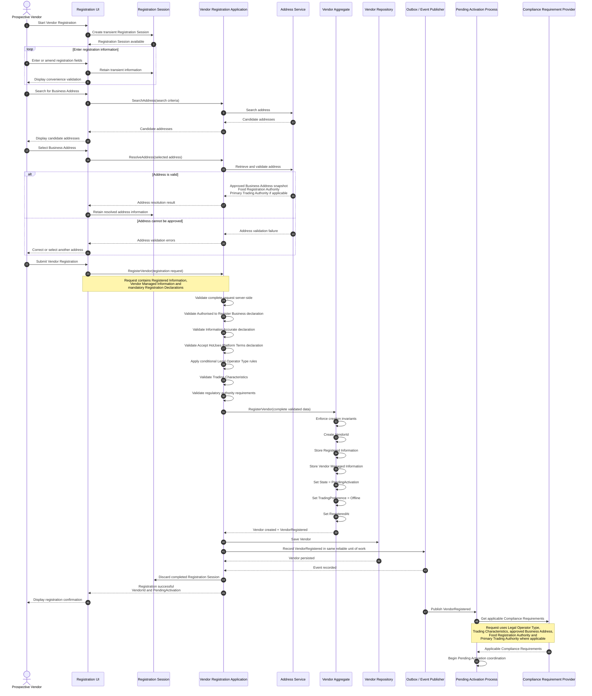
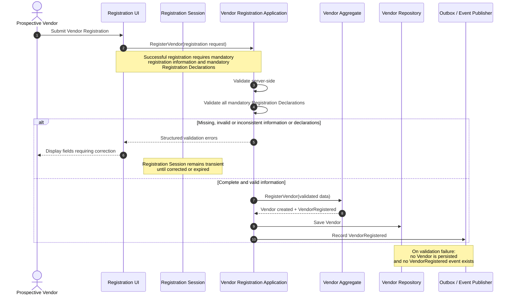
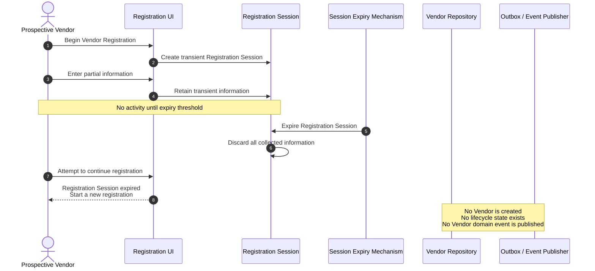
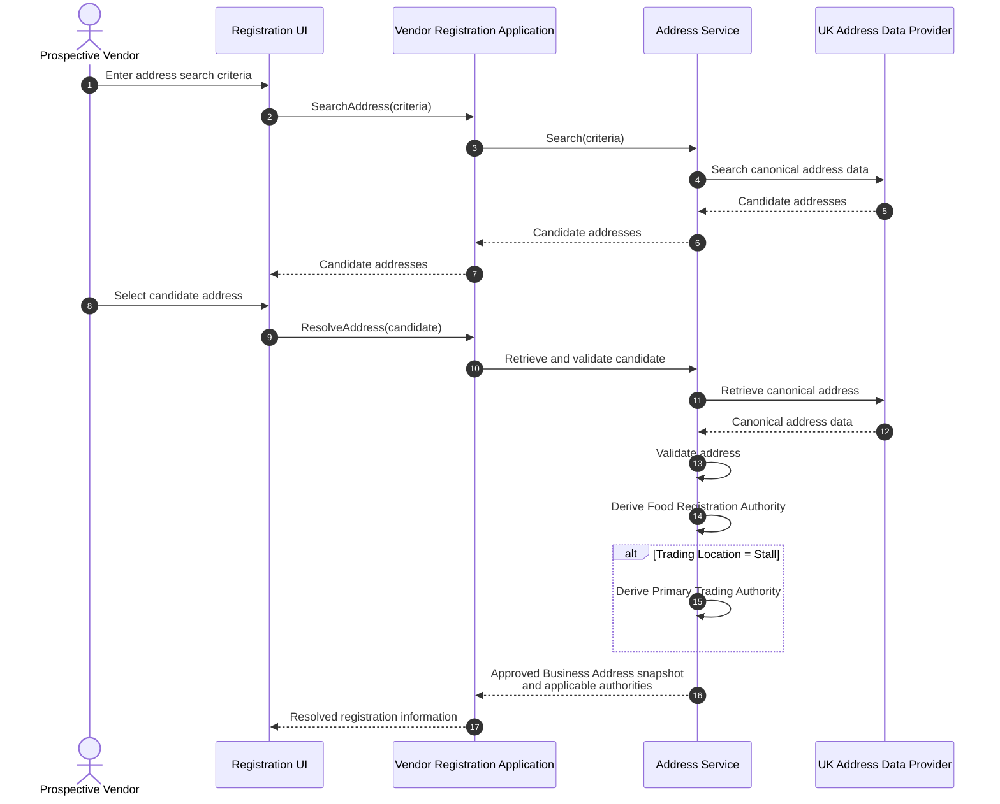
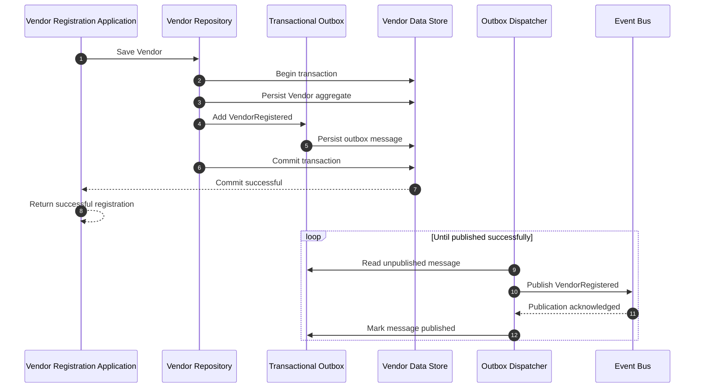

# HJ-105 – Vendor Registration Sequence Diagram

| Property | Value |
|---|---|
| **Document ID** | HJ-105 |
| **Document Title** | Vendor Registration Sequence Diagram |
| **Version** | 2.0 |
| **Status** | Approved |
| **Classification** | Model |
| **Owner** | Project Architecture |
| **Last Updated** | 24 July 2026 |

## Revision History

| Version | Date | Description |
|---|---|---|
| 0.1 | 22 July 2026 | Initial Vendor Registration behavioural model for Epic 1, including the successful registration flow, validation failure, Registration Session expiry, Address Domain collaboration and Compliance Requirement initiation. |
| 0.2 | 24 July 2026 | Applied CR-012 to explicitly include mandatory Registration Declarations in the registration request, server-side validation, validation checklist and sequence diagram guidance. |

## Related Documents

| Document ID | Title | Status |
|---|---|---|
| HJ-002 | Architectural Principles | Draft |
| HJ-003 | Ubiquitous Language Guide | Approved |
| HJ-004 | Vendor Domain Models | Approved |
| HJ-104 | Vendor Registration Fields Matrix | Approved |

# 1. Purpose

This document defines the runtime interactions required to complete **Epic 1 – Vendor Registration**.

It provides the behavioural bridge between:

- the architectural principles governing capability ownership and explicit contracts;
- the approved Vendor ubiquitous language;
- the Vendor aggregate and domain boundaries;
- the approved Vendor Registration field and validation requirements;
- the application services, domain model and infrastructure required to implement Vendor Registration.

The sequence diagrams are implementation guidance. They do not replace the authoritative business definitions in HJ-003, the domain model in HJ-004 or the registration requirements in HJ-104.

# 2. Scope

This document covers:

- creation and use of a transient Registration Session;
- collection of Registered Information, Vendor Managed Information and Registration Declarations;
- server-side validation of submitted registration information and Registration Declarations;
- Address Domain search, retrieval and validation;
- derivation of Food Registration Authority;
- derivation of Primary Trading Authority where Trading Location is `Stall`;
- creation of the Vendor aggregate;
- initial Vendor lifecycle state and Trading Preference;
- persistence of the Vendor;
- publication of `VendorRegistered`;
- initiation of Compliance Requirement generation;
- Registration Session expiry;
- controlled handling of validation and persistence failures.

This document does not cover:

- persisted or resumable registration drafts;
- Identity account creation or authentication;
- compliance evidence submission or verification;
- completion of the Pending Activation Process;
- Vendor Activation;
- registration amendment;
- multiple premises or Branches;
- Menu, Ordering, Payment or Delivery capabilities.

# 3. Architectural Principles Applied

The registration flow applies the following principles from HJ-002.

| Principle | Application |
|---|---|
| AP-000 – Reliability over Convenience | The Vendor and its event must be persisted and published reliably. Partial failure must remain recoverable and observable. |
| AP-001 – Business First | The flow models the deliberate business act of registering a Vendor rather than exposing persistence operations. |
| AP-002 – Domain Models Express Business Language | Commands, results and events use the approved Vendor terminology. |
| AP-003 – Business Capabilities Own Their Behaviour | Address validation remains in the Address Domain; Vendor invariants remain in the Vendor Domain; compliance rules remain in the Compliance Domain. |
| AP-004 – Business Capabilities Own Their Persistence | The Vendor Repository persists the Vendor aggregate. Other capabilities do not access Vendor persistence directly. |
| AP-005 – Single Authoritative Owner | The Address Domain supplies authoritative address results; the Vendor Domain owns the stored Business Address snapshot. |
| AP-006 – Explicit Published Contracts | Address and Compliance collaboration occurs through abstractions and published contracts. |
| AP-007 – Events Represent Completed Business Facts | `VendorRegistered` is raised only after the Vendor has been successfully created. |
| AP-008 – Explicit Modelling | Registration, validation, address resolution, Vendor creation and event publication are explicit steps. |
| AP-009 – Architectural Simplicity | Epic 1 uses transient Registration Sessions and stubbed external domains without introducing registration drafts or Branches. |
| AP-011 – Quality Attributes by Design | Validation, idempotency, transaction boundaries, recoverability and observability are explicit responsibilities. |
| AP-012 – Technology Independence | Business behaviour does not depend on a specific web framework, database or messaging technology. |

# 4. Participants and Responsibilities

| Participant | Responsibility |
|---|---|
| Prospective Vendor | Supplies registration information, confirms the mandatory Registration Declarations and submits Vendor Registration. |
| Registration UI | Collects information and Registration Declarations, performs convenience validation and presents results. It is not authoritative for business validation. |
| Registration Session | Holds transient information while registration is being completed. It is not a Domain Entity and produces no domain events. |
| Vendor Registration Application | Coordinates validation, Address Domain collaboration, Vendor creation, persistence and event publication. |
| Address Service | Published abstraction for address search, retrieval, validation and regulatory-authority derivation. |
| Vendor Aggregate | Enforces Vendor creation invariants and creates the Vendor in `PendingActivation` with Trading Preference `Offline`. |
| Vendor Repository | Persists the Vendor aggregate owned by the Vendor Domain. |
| Outbox / Event Publisher | Reliably records and publishes the completed business fact `VendorRegistered`. |
| Compliance Requirement Provider | Published abstraction used to request applicable Compliance Requirements. |
| Pending Activation Process | Coordinates the work required after registration to move the Vendor towards Activated or Deactivated. |

# 5. Vendor Registration Happy Path

The following diagram defines the primary Epic 1 registration sequence.

# 6. Registration Validation Failure

A failed submission does not create or persist a Vendor and does not raise a Vendor domain event.

Validation must include, as applicable:

- all mandatory registration fields;
- Authorised to Register Business declaration;
- Information Accurate declaration;
- Accept HotJoes Platform Terms declaration;
- controlled Legal Operator Type;
- conditional Company Registration Number;
- Company Registration Number format and uppercase normalisation;
- controlled Trading Location;
- Start Time and End Time without incorrectly rejecting overnight hours;
- Service Includes Hot Food;
- Alcohol Service;
- contact name, email and telephone;
- approved Business Address snapshot;
- Food Registration Authority;
- Primary Trading Authority when Trading Location is `Stall`;
- Website format when supplied;
- Business Description length when supplied.

User-interface validation may improve usability, but server-side validation is authoritative.

# 7. Registration Session Expiry

Registration Sessions expire automatically after inactivity. They cannot be resumed and have no business significance after expiry.

Registration Session expiry may produce technical telemetry or audit diagnostics, but it must not produce a Vendor domain event.

# 8. Address Resolution and Regulatory Authorities

Address behaviour belongs to the Address Domain. The Vendor Domain stores the approved snapshot returned through the Address Service contract.

The Address Service response used by registration must be sufficient to create:

- `BusinessAddressSnapshot`;
- `FoodRegistrationAuthority`;
- `PrimaryTradingAuthority`, when required.

The Vendor Domain must not reimplement address validation or regulatory-authority derivation.

# 9. Persistence and Event Publication Reliability

Vendor persistence and `VendorRegistered` publication form one reliable business operation.

The implementation shall use an appropriate reliability pattern, such as a transactional outbox, so that the system cannot report successful registration while silently losing either:

- the Vendor aggregate; or
- the completed business event.

A concrete implementation may use an equivalent mechanism, provided it preserves the same reliability guarantees.

# 10. Failure Behaviour

## 10.1 Address Failure

If address search, retrieval or validation fails:

- no Vendor is created;
- the applicant receives a controlled error;
- the Registration Session may remain available until expiry;
- failure details are observable;
- retry must not create duplicate Vendors.

## 10.2 Domain Validation Failure

If Vendor creation invariants fail:

- no Vendor is persisted;
- no `VendorRegistered` event is recorded;
- validation errors are returned in a structured form;
- technical exceptions are not exposed as business validation messages.

## 10.3 Persistence Failure

If Vendor persistence fails:

- registration is not reported as successful;
- no completed Registration Session is discarded until the outcome is known;
- the operation may be retried safely;
- duplicate Vendor creation must be prevented.

## 10.4 Event Dispatch Failure

If the Vendor has been persisted and the outbox message recorded but external event publication fails:

- the Vendor remains validly registered;
- the outbox message remains unpublished;
- publication is retried;
- the user is not required to register the Vendor again.

# 11. Idempotency and Concurrency

The `RegisterVendor` use case must be safe against duplicate submission caused by:

- repeated button selection;
- client retry;
- network timeout;
- application retry;
- concurrent processing of the same submitted registration.

The implementation shall use an explicit idempotency mechanism or equivalent uniqueness constraint.

Repeated processing of the same successful submission must not:

- create more than one Vendor;
- publish multiple misleading `VendorRegistered` business events;
- initiate duplicate Pending Activation Processes;
- create duplicate Compliance Requirements.

# 12. Resulting Vendor State

After successful registration:

| Property | Result |
|---|---|
| Vendor exists | Yes |
| Vendor State | `PendingActivation` |
| Trading Preference | `Offline` |
| Registered Information | Stored and read-only to the Vendor |
| Vendor Managed Information | Stored where supplied |
| Business Address | Approved snapshot stored by the Vendor Domain |
| Food Registration Authority | Stored |
| Primary Trading Authority | Stored when applicable |
| Vendor may trade | No |
| Vendor may be activated immediately by registration | No |
| `VendorRegistered` | Recorded and published reliably |
| Pending Activation Process | Initiated |
| Compliance Requirements | Requested through the Compliance Requirement Provider |

# 13. Epic 1 Implementation Boundary

## 13.1 Required

Epic 1 requires:

- transient Registration Session handling;
- automatic expiry and complete discard;
- non-resumable registration;
- registration field and Registration Declaration collection;
- authoritative server-side validation;
- Address Service abstraction and stub implementation;
- Business Address snapshot;
- regulatory-authority derivation;
- Vendor aggregate creation;
- `PendingActivation` lifecycle state;
- `Offline` Trading Preference;
- Vendor persistence;
- reliable `VendorRegistered` publication;
- Compliance Requirement Provider abstraction and stub implementation;
- registered Vendor retrieval.

## 13.2 Deferred

Epic 1 defers:

- registration drafts;
- Branches and multiple premises;
- registration amendment;
- full Address Domain integration;
- full Compliance Domain implementation;
- evidence workflows;
- completion of the Pending Activation Process;
- Vendor Activation;
- Menu and Ordering behaviour;
- Operational Availability composition.

# 14. Design Decisions

## Decision 1: Registration Session is outside the Vendor Domain Model

Registration Session is a transient application concept. It exists before the Vendor and produces no Vendor domain events.

## Decision 2: Vendor creation is the registration transaction boundary

The Vendor is created only after complete and valid registration information and all mandatory Registration Declarations have been submitted and validated.

## Decision 3: Address ownership remains explicit

The Address Domain searches, retrieves and validates addresses and derives applicable authorities. The Vendor Domain stores the approved Business Address snapshot.

## Decision 4: Registration and activation remain separate

Successful registration creates a Vendor in `PendingActivation`. It does not authorise trading.

## Decision 5: Vendor creation and event recording are reliable

The Vendor and `VendorRegistered` event are persisted as one reliable business operation.

## Decision 6: Compliance rules remain outside the Vendor Domain

The Pending Activation Process requests applicable Compliance Requirements through an abstraction. The Vendor Domain does not contain regulatory decision logic.

## Decision 7: Epic 1 models one trading location

A Vendor represents one trading location during Epic 1. Branches and multiple premises are deferred.

# 15. Implementation Checklist

Before Epic 1 is considered complete, confirm that:

- [ ] incomplete Registration Sessions expire and are discarded;
- [ ] expired Registration Sessions cannot be resumed;
- [ ] validation failure creates no Vendor;
- [ ] all HJ-104 field rules are enforced server-side;
- [ ] all mandatory Registration Declarations are enforced server-side;
- [ ] Address Service ownership is respected;
- [ ] an approved Business Address snapshot is stored;
- [ ] Food Registration Authority is derived and stored;
- [ ] Primary Trading Authority is required only for `Stall`;
- [ ] the Vendor begins in `PendingActivation`;
- [ ] the Vendor begins `Offline`;
- [ ] Registered Information is read-only to the Vendor;
- [ ] `VendorRegistered` represents a completed business fact;
- [ ] Vendor persistence and event recording cannot diverge silently;
- [ ] duplicate submission cannot create duplicate Vendors or events;
- [ ] Compliance Requirements are requested through the approved abstraction;
- [ ] no deferred capability has been introduced into Epic 1.
