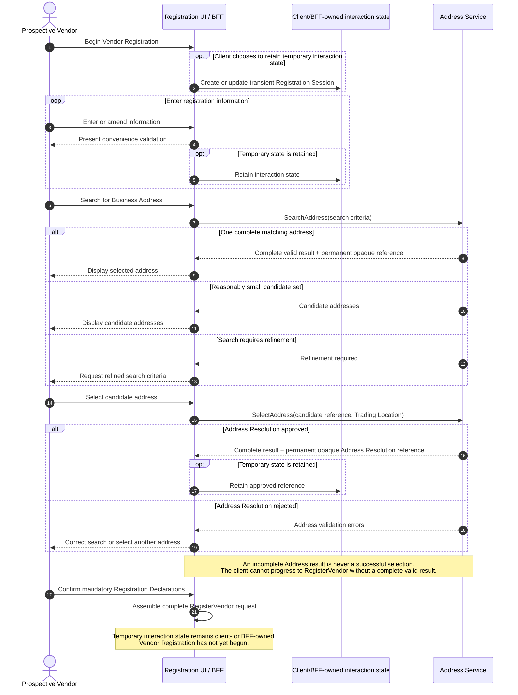
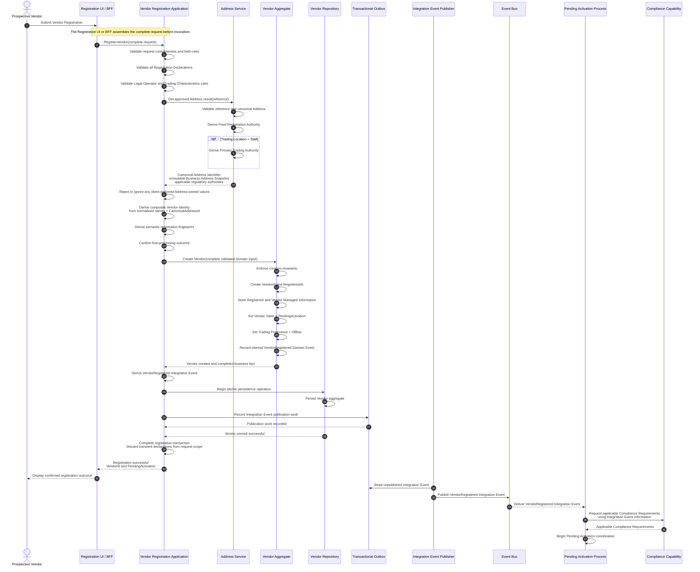
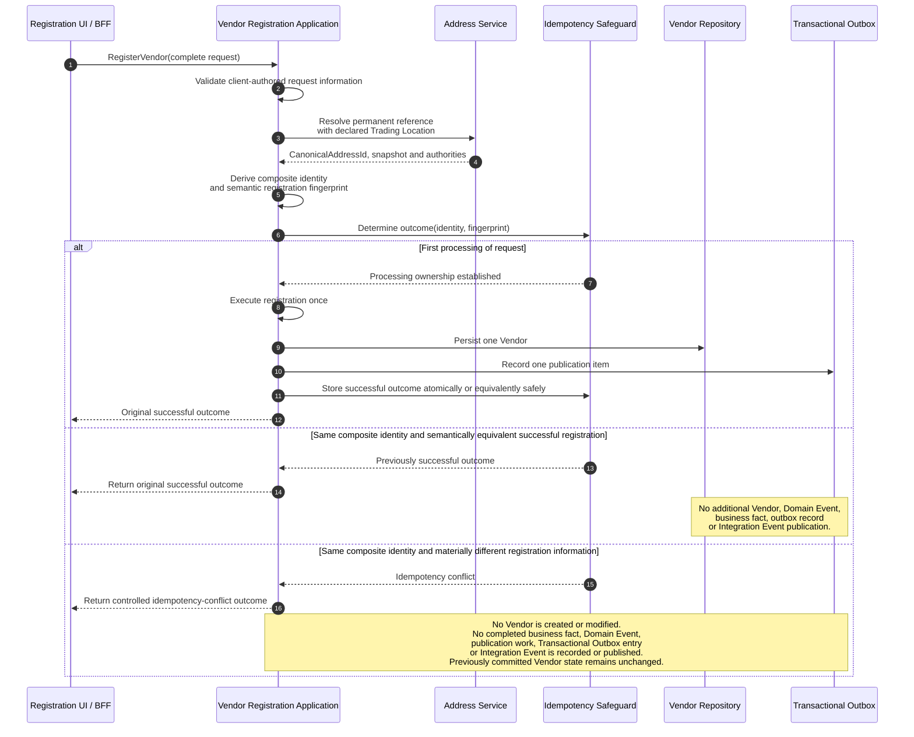
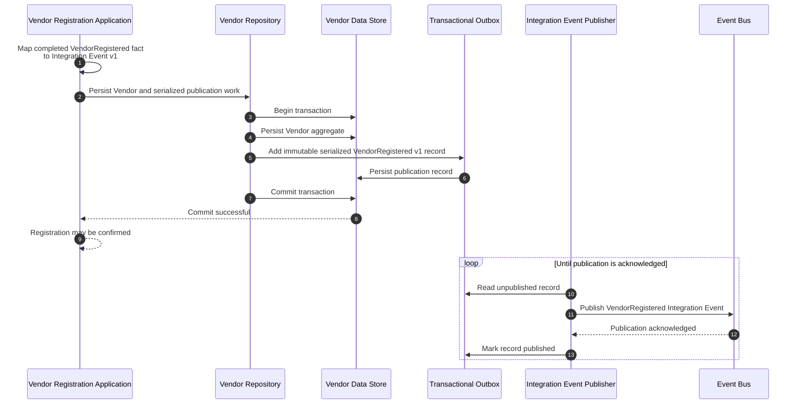
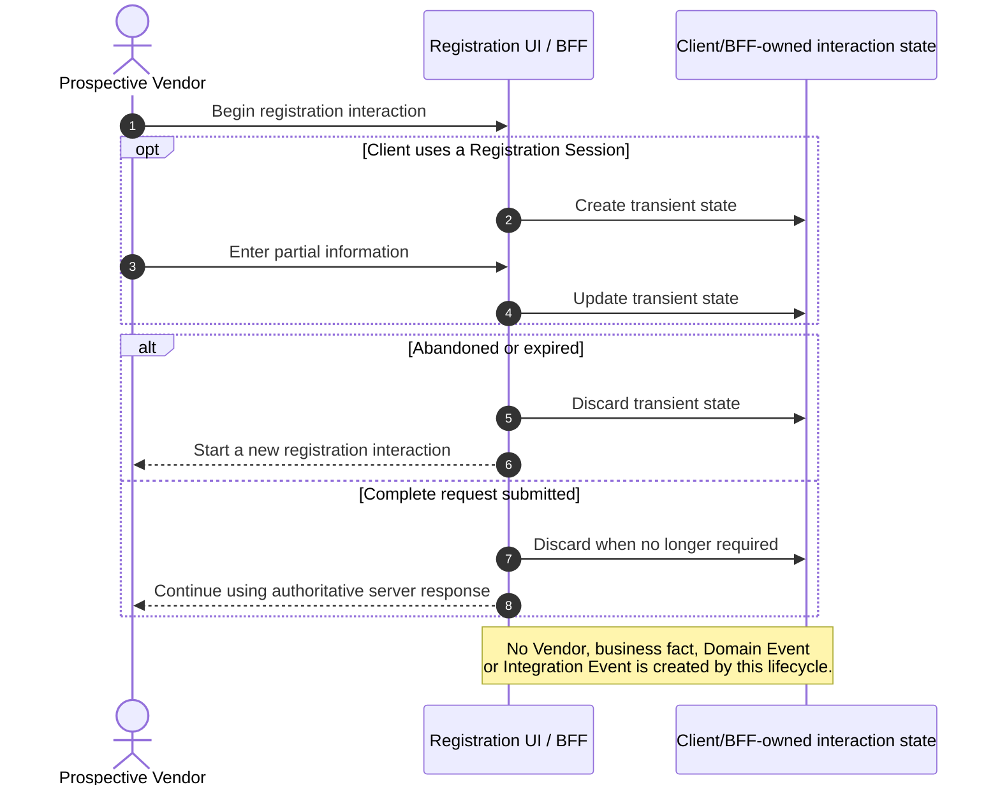
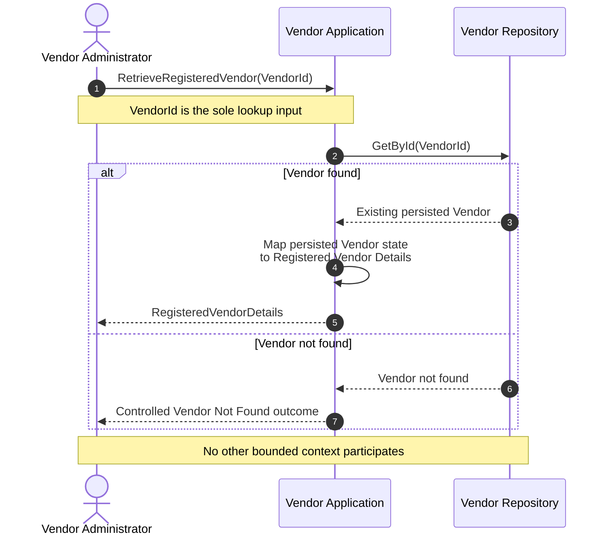

# HJ-105 - Vendor Registration Sequence Diagram

| Property | Value |
|---|---|
| **Document ID** | HJ-105 |
| **Document Title** | Vendor Registration Sequence Diagram |
| **Version** | 3.8 |
| **Status** | Approved |
| **Classification** | Model |
| **Owner** | Project Architecture |
| **Last Updated** | 23 August 2026 |

## Revision History

| Version | Date | Description |
|---|---|---|
| 0.1 | 22 July 2026 | Initial Vendor Registration behavioural model for Epic 1, including the successful registration flow, validation failure, Registration Session expiry, Address Domain collaboration and Compliance Requirement initiation. |
| 0.2 | 24 July 2026 | Added mandatory Registration Declarations to the registration request, server-side validation, validation checklist and sequence guidance. |
| 2.0 | 24 July 2026 | Approved the consolidated Vendor Registration behavioural baseline. |
| 3.0 | 28 July 2026 | Regenerated from the approved Vendor language, domain model and registration requirements and the accepted architectural decisions. Realigned Registration Session ownership, request and Address trust boundaries, creation invariants, idempotency, Domain and Integration Events, reliable publication and downstream activation initiation. |
| 3.1 | 8 August 2026 | Applied CR-026 to add the separate Epic 1 Retrieve Registered Vendor sequence, including the successful and Vendor Not Found outcomes and query boundary constraints. |
| 3.2 | 8 August 2026 | Applied CR-029 to incorporate the controlled idempotency-conflict behaviour defined by ADR-008 and update ADR-008 traceability references. No business behaviour changed beyond alignment with the approved architecture. |
| 3.3 | 12 August 2026 | Applied CR-033 to align the Epic 1 runtime interactions, downstream event-consumer stub and client/BFF-owned Registration Session with HJ-011. |
| 3.4 | 13 August 2026 | Applied CR-035 to remove delivery-slice scope and restore HJ-105 as the enduring Vendor Registration behavioural model. |
| 3.5 | 17 August 2026 | Applied CR-051. Aligned Address search, selection, contextual reference resolution, application-port orchestration and semantic/technical failure behaviour with CON-006–CON-011. |
| 3.6 | 19 August 2026 | Applied CR-058. Defined the CON-013 composite Vendor uniqueness identity and semantic replay outcomes, and moved identity evaluation after authoritative Address resolution supplies CanonicalAddressId. |
| 3.7 | 22 August 2026 | Applied CR-064. Added the approved CON-019 pre-outbox mapping step and CON-020 VendorRegistered v1 envelope, payload, serialization and compatibility rules. |
| 3.8 | 23 August 2026 | Applied CR-TBD-HJ105. Added the approved deterministic VendorRegistered v1 JSON representations to the publication behaviour and preserved the existing interaction sequence. |

## Related Documents

| Document ID | Title | Status | Relevance |
|---|---|---|---|
| HJ-002 | Architectural Principles | Approved | Supporting architectural principles |
| HJ-003 | Ubiquitous Language Guide | Approved | Authoritative business terminology |
| HJ-004 | Vendor Domain Models | Approved | Vendor aggregate, invariants, lifecycle and event model |
| HJ-104 | Vendor Registration Fields Matrix | Approved | Authoritative registration information and business rules |
| ADR-002 | Business Capabilities and Bounded Contexts | Accepted | Capability and data ownership |
| ADR-003 | Event-Driven Collaboration | Accepted | Cross-context event collaboration |
| ADR-004 | Vendor Lifecycle Begins After Successful Registration | Accepted | Registration Session, service and lifecycle boundaries |
| ADR-005 | Registered Information vs Vendor Managed Information | Accepted | Information classification |
| ADR-006 | Address Domain Ownership and Business Address Snapshots | Accepted | Address trust boundary and snapshot ownership |
| ADR-007 | Vendor Compliance as a Separate Bounded Context | Accepted | Compliance boundary and activation dependency |
| ADR-008 | Idempotent Operations and Reliable Event Publication | Accepted | Idempotency and publication reliability |
| CR-026 | Define Registered Vendor Retrieval for Epic 1 | Approved | Registered Vendor retrieval behaviour and scope |
| CR-035 | Remove Delivery-Slice Scope from Vendor Registration Behavioural Model | Approved | Enduring behavioural-model scope and responsibility |

# 1. Purpose and Authority

This document defines the runtime interactions required for **Vendor Registration**, including the associated retrieval of a registered Vendor.

It is the behavioural bridge between the approved registration language, registration-information contract, Vendor aggregate and accepted architectural decisions. It describes interaction order and responsibility; it does not redefine the underlying business rules.

The authoritative sources are applied in the following order for their respective concerns:

- **HJ-003** for business terminology;
- **HJ-104** for registration fields, classifications, validation and information lifecycle;
- **HJ-004** for aggregate behaviour, creation invariants, resulting state and events;
- the accepted ADRs for capability ownership, Address ownership, lifecycle boundaries, idempotency, reliable publication and cross-context collaboration.

HJ-105 defines interaction behaviour and does not determine delivery scope. Approved Change Requests are applied through the revised production artefacts listed above. CR-026 is reflected directly to define the registered Vendor retrieval capability, CR-029 aligns controlled idempotency-conflict behaviour and ADR-008 traceability, and CR-035 restores the enduring behavioural model.

# 2. Scope and Boundary

This document covers:

- client or BFF assembly of registration information;
- Address search and selection before registration submission;
- submission of one complete, self-contained `RegisterVendor` request;
- server-side validation of client-authored information and Registration Declarations;
- authoritative Address Domain retrieval using the approved Address Resolution reference;
- Vendor aggregate creation and invariant enforcement;
- Vendor persistence and durable Integration Event recording;
- synchronous confirmation of successful registration;
- asynchronous publication of `VendorRegistered`;
- downstream initiation of the Pending Activation Process through the published `VendorRegistered` Integration Event;
- collaboration with the Compliance capability through its approved boundary;
- validation, address, invariant, persistence and publication failures;
- idempotent and concurrent duplicate processing;
- retrieval of one registered Vendor by VendorId;
- mapping of persisted Vendor state to Registered Vendor Details; and
- the controlled Vendor Not Found outcome.

This document does not place Registration Session management inside the Vendor Registration service. It also excludes:

- persisted or resumable registration drafts;
- Identity account creation or authentication;
- Compliance evidence submission, evaluation or continuing monitoring;
- Vendor Activation;
- registration amendment;
- multiple premises or Branches;
- Menu, Ordering, Payment and Delivery capabilities;
- Vendor search, filtering, paging or multiple-Vendor retrieval;
- retrieval authentication, authorisation or Identity collaboration;
- Address or Compliance callbacks during retrieval; and
- dedicated read-model infrastructure.

# 3. Architectural Rules Applied

| Rule | Behavioural application |
|---|---|
| Client interaction boundary | A Registration Session, if used, is owned entirely by the client application or BFF and never participates in Vendor Registration service processing. |
| Registration boundary | Vendor Registration begins only when the service receives a complete `RegisterVendor` request. |
| Request authority | The request is authoritative for client-authored registration information and the approved Address Resolution reference. |
| Address authority | Address-owned values are retrieved through the Vendor Application Address Resolution port using the approved reference and the same Trading Location bound at selection; they are never trusted from client-authored values. |
| Address result completeness | The client cannot submit RegisterVendor until Address selection returns a complete valid result containing a CanonicalAddressId and the required authority information. |
| Address failure | Semantic rejection fails fast. Technical timeout, unavailability or transient failure returns a controlled retryable application failure without in-process automatic retry; Epic 1 has no circuit breaker. |
| Server authority | User-interface validation is advisory; server-side validation and aggregate invariants are authoritative. |
| Vendor existence | No Vendor exists before successful processing. A successful request creates the Vendor in `PendingActivation` and `Offline`. |
| Declaration lifecycle | Registration Declarations influence the registration decision only and are never persisted or included in Domain or Integration Events. |
| Event separation | The internal `VendorRegistered` Domain Event and published `VendorRegistered` Integration Event are distinct architectural concepts. |
| Reliable publication | Vendor persistence and durable recording of publication work occur atomically. Publication may be retried without repeating registration. |
| Vendor uniqueness and replay | After authoritative Address resolution, `RegisterVendor` derives the Vendor uniqueness identity from trimmed, case-insensitive Trading Name, trimmed, case-insensitive Legal Operator Name and `CanonicalAddressId`. An equivalent successful replay returns the original committed result without additional business effects. The same identity with materially different registration information returns `IdempotencyConflict` without creating or updating a Vendor. |
| Capability autonomy | The Pending Activation Process consumes the published `VendorRegistered` Integration Event and does not synchronously retrieve registration information from the Vendor Domain where that information is already present in the published contract. Compliance remains a downstream capability with its own behaviour and ownership. |
| Retrieval lookup | `RetrieveRegisteredVendor` uses VendorId as its sole lookup input and performs no search. |
| Retrieval authority | The persisted Vendor aggregate is the authoritative read source; the application maps it to Registered Vendor Details rather than exposing it directly. |
| Retrieval isolation | Registered Vendor retrieval is read-only, has no events or lifecycle effects and invokes no other bounded context. |

# 4. Participants and Responsibilities

| Participant | Responsibility |
|---|---|
| Prospective Vendor | Supplies registration information, confirms all Registration Declarations and submits Vendor Registration. |
| Registration UI / BFF | Owns any temporary interaction state, performs convenience validation, coordinates Address search and selection, assembles the complete request and presents the result. |
| Address Service | Provides Address search and approved Address Resolution references; authoritatively returns canonical identity, immutable snapshot and applicable regulatory authorities. |
| Vendor Registration Application | Validates the complete request, obtains Address-owned values, derives the composite Vendor identity and semantic registration fingerprint, determines the registration or replay outcome, invokes the aggregate only for first processing, coordinates persistence and returns the authoritative result. |
| Vendor Aggregate | Enforces Vendor creation invariants, creates the Vendor and records the internal completed business fact. |
| Vendor Repository | Persists the Vendor aggregate owned by the Vendor Domain. |
| Transactional Outbox | Durably records publication work in the same atomic unit as Vendor persistence. |
| Integration Event Publisher | Publishes recorded Integration Events and retries failed publication without repeating registration. |
| Event Bus | Delivers published contracts to subscribing capabilities. |
| Pending Activation Process | Reacts to `VendorRegistered` and coordinates post-registration work required to move the Vendor towards an activation outcome. |
| Compliance Capability | Determines applicable Compliance Requirements through the approved Compliance boundary. |

A Registration Session is deliberately absent from the server-side participant list. A client application or BFF may own transient interaction state, but the Vendor Registration Application neither knows nor depends on it.

# 5. Complete RegisterVendor Request

The Registration UI or BFF shall submit one complete, self-contained request containing:

- all client-authored Registered Information required by HJ-104;
- optional Vendor Managed Information when supplied;
- all mandatory Registration Declarations; and
- the approved Address Resolution reference.

The request does **not** authoritatively supply:

- Canonical Address Identifier;
- Business Address Snapshot;
- Food Registration Authority; or
- Primary Trading Authority.

Those values originate exclusively from the Address Domain. Client-supplied snapshot or regulatory-authority values shall be ignored or rejected.

The three mandatory Registration Declarations are:

- Authorised to Register Business;
- Information Accurate; and
- Accept HotJoes Platform Terms.

They are transient inputs to the registration decision. They are not Registered Information or Vendor Managed Information, are not stored on the aggregate, appear in neither event type and have no lifecycle after request processing. Any permitted audit retention is outside the Vendor Domain.

# 6. Client Assembly and Address Selection

This sequence occurs outside the Vendor Registration service boundary. The Registration UI or BFF may retain temporary information locally while the prospective Vendor completes the interaction.

```mermaid
sequenceDiagram
    autonumber
    actor Applicant as Prospective Vendor
    participant Client as Registration UI / BFF
    participant LocalState as Client/BFF-owned interaction state
    participant Address as Address Service

    Applicant->>Client: Begin Vendor Registration
    opt Client chooses to retain temporary interaction state
        Client->>LocalState: Create or update transient Registration Session
    end

    loop Enter registration information
        Applicant->>Client: Enter or amend information
        Client-->>Applicant: Present convenience validation
        opt Temporary state is retained
            Client->>LocalState: Retain interaction state
        end
    end

    Applicant->>Client: Search for Business Address
    Client->>Address: SearchAddress(search criteria)
    alt One complete matching address
        Address-->>Client: Complete valid result + permanent opaque reference
        Client-->>Applicant: Display selected address
    else Reasonably small candidate set
        Address-->>Client: Candidate addresses
        Client-->>Applicant: Display candidate addresses
    else Search requires refinement
        Address-->>Client: Refinement required
        Client-->>Applicant: Request refined search criteria
    end

    Applicant->>Client: Select candidate address
    Client->>Address: SelectAddress(candidate reference, Trading Location)
    alt Address Resolution approved
        Address-->>Client: Complete result + permanent opaque Address Resolution reference
        opt Temporary state is retained
            Client->>LocalState: Retain approved reference
        end
    else Address Resolution rejected
        Address-->>Client: Address validation errors
        Client-->>Applicant: Correct search or select another address
    end

    Note over Client,Address: An incomplete Address result is never a successful selection.<br/>The client cannot progress to RegisterVendor without a complete valid result.

    Applicant->>Client: Confirm mandatory Registration Declarations
    Client->>Client: Assemble complete RegisterVendor request
    Note over Client: Temporary interaction state remains client- or BFF-owned.<br/>Vendor Registration has not yet begun.
```

The displayed Address result supports selection and user confirmation. It is not the authoritative source persisted by the Vendor. Authoritative Address-owned values are retrieved again by the Vendor Registration Application using the approved reference during request validation.

# 7. Successful Vendor Registration

```mermaid
sequenceDiagram
    autonumber
    actor Applicant as Prospective Vendor
    participant Client as Registration UI / BFF
    participant Application as Vendor Registration Application
    participant Address as Address Service
    participant Vendor as Vendor Aggregate
    participant Repository as Vendor Repository
    participant Outbox as Transactional Outbox
    participant Publisher as Integration Event Publisher
    participant Bus as Event Bus
    participant Pending as Pending Activation Process
    participant Compliance as Compliance Capability

    Applicant->>Client: Submit Vendor Registration
    Note over Client,Application: The Registration UI or BFF assembles the complete request before invocation.
    Client->>Application: RegisterVendor(complete request)

    Application->>Application: Validate request completeness and field rules
    Application->>Application: Validate all Registration Declarations
    Application->>Application: Validate Legal Operator and Trading Characteristics rules

    Application->>Address: Get approved Address result(reference)
    Address->>Address: Validate reference and canonical Address
    Address->>Address: Derive Food Registration Authority
    opt Trading Location = Stall
        Address->>Address: Derive Primary Trading Authority
    end
    Address-->>Application: Canonical Address Identifier<br/>immutable Business Address Snapshot<br/>applicable regulatory authorities

    Application->>Application: Reject or ignore any client-authored Address-owned values
    Application->>Application: Derive composite Vendor identity<br/>from normalized names + CanonicalAddressId
    Application->>Application: Derive semantic registration fingerprint
    Application->>Application: Confirm first-processing outcome
    Application->>Vendor: Create Vendor(complete validated Domain input)
    Vendor->>Vendor: Enforce creation invariants
    Vendor->>Vendor: Create VendorId and RegisteredAt
    Vendor->>Vendor: Store Registered and Vendor Managed Information
    Vendor->>Vendor: Set Vendor State = PendingActivation
    Vendor->>Vendor: Set Trading Preference = Offline
    Vendor->>Vendor: Record internal VendorRegistered Domain Event
    Vendor-->>Application: Vendor created and completed business fact

    Application->>Application: Derive VendorRegistered Integration Event
    Application->>Repository: Begin atomic persistence operation
    Repository->>Repository: Persist Vendor aggregate
    Application->>Outbox: Record Integration Event publication work
    Outbox-->>Application: Publication work recorded
    Repository-->>Application: Atomic commit successful

    Application->>Application: Complete registration transaction<br/>Discard transient declarations from request scope
    Application-->>Client: Registration successful<br/>VendorId and PendingActivation
    Client-->>Applicant: Display confirmed registration outcome

    Publisher->>Outbox: Read unpublished Integration Event
    Publisher->>Bus: Publish VendorRegistered Integration Event
    Bus-->>Pending: Deliver VendorRegistered Integration Event
    Pending->>Compliance: Request applicable Compliance Requirements<br/>using Integration Event information
    Compliance-->>Pending: Applicable Compliance Requirements
    Pending->>Pending: Begin Pending Activation coordination
```

The synchronous response confirms the committed Vendor state. Downstream Pending Activation and Compliance collaboration proceeds asynchronously and does not change that response.

The Pending Activation Process obtains the registration information required to begin coordination from the published Integration Event and collaborates with the Compliance capability through the approved boundary. It shall not synchronously query the Vendor Domain for registration information already supplied by the published contract. Registration itself does not complete Compliance processing.

# 8. Validation and Creation Failure

```mermaid
sequenceDiagram
    autonumber
    actor Applicant as Prospective Vendor
    participant Client as Registration UI / BFF
    participant Application as Vendor Registration Application
    participant Address as Address Service
    participant Vendor as Vendor Aggregate
    participant Repository as Vendor Repository
    participant Outbox as Transactional Outbox

    Applicant->>Client: Submit Vendor Registration
    Client->>Application: RegisterVendor(complete request)
    Application->>Application: Validate request and Registration Declarations

    alt Request or declaration validation fails
        Application-->>Client: Structured validation errors
        Client-->>Applicant: Display fields requiring correction
    else Request validation succeeds
        Application->>Address: Get approved Address result(reference)
        alt Address reference or Address result is invalid
            Address-->>Application: Controlled Address validation failure
            Application-->>Client: Structured Address error
            Client-->>Applicant: Correct or select another address
        else Authoritative Address result returned
            Address-->>Application: Canonical identifier, snapshot and authorities
            Application->>Vendor: Create Vendor(complete validated Domain input)
            alt Aggregate invariant fails
                Vendor-->>Application: Domain validation errors
                Application-->>Client: Structured validation errors
                Client-->>Applicant: Display fields requiring correction
            else Aggregate creation succeeds
                Vendor-->>Application: Vendor and completed business fact
                Application->>Repository: Persist Vendor atomically with publication work
                Application->>Outbox: Record Integration Event publication work
            end
        end
    end

    Note over Repository,Outbox: For every validation, Address or invariant failure:<br/>no Vendor is persisted;<br/>no completed business fact or Domain Event is recorded;<br/>no publication record or Integration Event exists.
```

The Vendor Registration service retains no Registration Session after failure. The client application or BFF alone decides whether to retain interaction state so the applicant can correct and resubmit information.

Server-side validation shall enforce all HJ-104 rules, including:

- all mandatory fields and formats;
- controlled Legal Operator Type and Trading Location values;
- conditional Company Registration Number presence and canonical uppercase storage;
- Opening Hours that permit legitimate overnight periods;
- all three mandatory Registration Declarations;
- approved Address Resolution reference;
- Primary Trading Authority presence only for `Stall`;
- optional Website HTTPS format; and
- optional Business Description maximum length.

# 9. Idempotent Replay and Concurrency

`RegisterVendor` is not naturally idempotent. After resolving the approved Address Resolution reference, the Vendor Application derives a composite Vendor uniqueness identity from:

- Trading Name compared after trimming and without regard to case;
- Legal Operator Name compared after trimming and without regard to case; and
- the authoritative `CanonicalAddressId` returned by the Address capability.

The normalized name comparison forms do not replace the registered display values. The opaque Address Resolution reference is not part of the identity.

```mermaid
sequenceDiagram
    autonumber
    participant Client as Registration UI / BFF
    participant Application as Vendor Registration Application
    participant Address as Address Service
    participant Idempotency as Idempotency Safeguard
    participant Repository as Vendor Repository
    participant Outbox as Transactional Outbox

    Client->>Application: RegisterVendor(complete request)
    Application->>Application: Validate client-authored request information
    Application->>Address: Resolve permanent reference<br/>with declared Trading Location
    Address-->>Application: CanonicalAddressId, snapshot and authorities
    Application->>Application: Derive composite identity<br/>and semantic registration fingerprint
    Application->>Idempotency: Determine outcome(identity, fingerprint)

    alt First processing of request
        Idempotency-->>Application: Processing ownership established
        Application->>Application: Execute registration once
        Application->>Repository: Persist one Vendor
        Application->>Outbox: Record one publication item
        Application->>Idempotency: Store successful outcome atomically or equivalently safely
        Application-->>Client: Original successful outcome
    else Same composite identity and semantically equivalent successful registration
        Idempotency-->>Application: Previously successful outcome
        Application-->>Client: Return original successful outcome
        Note over Repository,Outbox: No additional Vendor, Domain Event,<br/>business fact, outbox record<br/>or Integration Event publication.
    else Same composite identity and materially different registration information
        Idempotency-->>Application: Idempotency conflict
        Application-->>Client: Return controlled idempotency-conflict outcome
        Note over Application,Outbox: No Vendor is created or modified.<br/>No completed business fact, Domain Event,<br/>publication work, Transactional Outbox entry<br/>or Integration Event is recorded or published.<br/>Previously committed Vendor state remains unchanged.
    end
```

The three outcomes are distinct:

- first successful processing executes registration once;
- replay applies only to the same composite identity and semantically equivalent registration information and returns the original committed successful result; and
- the same composite identity with materially different registration information returns `IdempotencyConflict`.

Semantic registration equivalence compares all materially relevant registration information after its approved canonicalisation. It excludes transient Registration Declarations, the opaque Address Resolution reference, server-generated values and technical metadata.

Conflict processing creates no Vendor, modifies no existing Vendor, records no completed business fact, Domain Event, publication work or Transactional Outbox entry, publishes no Integration Event and leaves all previously committed Vendor state unchanged.

Concurrent requests with the same composite identity and semantically equivalent information must converge on one processing owner and one successful outcome. Registration Session state is outside the idempotency boundary and shall never be consulted.

The concurrency technique, replay persistence and retention, transaction mechanics, and database enforcement are governed separately by CON-014, CON-015, CON-016 and CON-028. The exact fingerprint encoding and storage representation remain implementation concerns within those approved boundaries.

# 10. Persistence and Publication Reliability

Vendor persistence and durable recording of the corresponding Integration Event publication work form one atomic operation.

```mermaid
sequenceDiagram
    autonumber
    participant Application as Vendor Registration Application
    participant Repository as Vendor Repository
    participant Store as Vendor Data Store
    participant Outbox as Transactional Outbox
    participant Publisher as Integration Event Publisher
    participant Bus as Event Bus

    Application->>Application: Map completed VendorRegistered fact<br/>to Integration Event v1
    Application->>Repository: Persist Vendor and serialized publication work
    Repository->>Store: Begin transaction
    Repository->>Store: Persist Vendor aggregate
    Repository->>Outbox: Add immutable serialized VendorRegistered v1 record
    Outbox->>Store: Persist publication record
    Repository->>Store: Commit transaction
    Store-->>Application: Commit successful
    Application-->>Application: Registration may be confirmed

    loop Until publication is acknowledged
        Publisher->>Outbox: Read unpublished record
        Publisher->>Bus: Publish VendorRegistered Integration Event
        Bus-->>Publisher: Publication acknowledged
        Publisher->>Outbox: Mark record published
    end
```

The internal Domain Event is not the outbox message. Before outbox persistence, an explicit Vendor Application mapper translates the completed business fact and registration-time information into the approved Integration Event. Vendor Infrastructure serializes and stores that contract unchanged. The relay publishes the stored event and does not reconstruct it from current Vendor state.

## 10.1 Minimum VendorRegistered Integration Event Contract

The published `VendorRegistered` Integration Event shall contain, at a minimum:

- VendorId;
- RegisteredAt;
- resulting Vendor State;
- Trading Preference;
- Legal Operator Type;
- Trading Characteristics;
- the approved registration-time Business Address information required by downstream Compliance processing;
- Food Registration Authority; and
- Primary Trading Authority, where applicable.

### VendorRegistered v1 Business Address

The Address information must:
- originate from the authoritative Address Domain result used to create the Vendor;
- represent the approved registration-time Business Address;
- carry the approved registration-time information required by eventual downstream Compliance processing without a synchronous Vendor Domain callback; and
- exclude client-authored or independently reconstructed Address information.

The Integration Event-owned `BusinessAddress` contains `CanonicalAddressId`, optional `RecipientOrOrganisationName`, required `AddressLine1`, optional `AddressLine2`, optional `AddressLine3`, required `PostTown`, required `Postcode` and optional `County`. It does not expose or reuse the Vendor Domain `BusinessAddressSnapshot` type.

### VendorRegistered v1 Envelope and Compatibility

The stable envelope contains `EventId`, `EventType` `VendorRegistered`, `EventVersion` `1`, `OccurredAt` and the immutable payload. The event is serialized once as UTF-8 camel-case JSON before outbox persistence and published unchanged. Optional values are explicitly `null`.

The mapper and serializer produce the exact nested member structure and deterministic identifier, timestamp, time, enum and explicit-null representations defined by HJ-004 §7.2. The Integration Event contract owns those published representations and does not expose or reuse Vendor Domain Aggregate, Value Object or enum types. This representation requirement does not add another runtime interaction or change the sequence above.

Compatible optional additions are permitted within v1 and consumers tolerate unknown fields. Removal, renaming, type or meaning changes require a new version. Retries retain the original EventId, version and serialized event.

The contract purpose is to support downstream Compliance and Pending Activation processing without a synchronous Vendor callback.

Registration Declarations shall never appear in the Integration Event. Implementation-specific metadata may be added provided the minimum business content and contract semantics are preserved.

# 11. Client / BFF-Owned Registration Session Lifecycle

A Registration Session, if used, is client- or BFF-owned interaction state and is not part of Vendor Registration processing.

```mermaid
sequenceDiagram
    autonumber
    actor Applicant as Prospective Vendor
    participant Client as Registration UI / BFF
    participant LocalState as Client/BFF-owned interaction state

    Applicant->>Client: Begin registration interaction
    opt Client uses a Registration Session
        Client->>LocalState: Create transient state
        Applicant->>Client: Enter partial information
        Client->>LocalState: Update transient state
    end

    alt Abandoned or expired
        Client->>LocalState: Discard transient state
        Client-->>Applicant: Start a new registration interaction
    else Complete request submitted
        Client->>LocalState: Discard when no longer required
        Client-->>Applicant: Continue using authoritative server response
    end

    Note over Client,LocalState: No Vendor, business fact, Domain Event<br/>or Integration Event is created by this lifecycle.
```

The concrete storage mechanism, timeout and expiry policy are client implementation decisions. An abandoned or expired Registration Session cannot be resumed as Vendor business state.

# 12. Failure Behaviour

## 12.1 Request or Declaration Validation Failure

- Return structured validation errors.
- Persist no Vendor.
- Record no completed business fact, Domain Event, publication work or Integration Event.
- Retain no server-side interaction state.

## 12.2 Address Failure

- Return `InvalidReference` for an unknown or fabricated Address Resolution reference.
- Return `InvalidAddressResult` when a known immutable result cannot satisfy the submitted Trading Location context or lacks required authoritative values.
- Reject or ignore client-authored Address-owned values.
- Persist no Vendor and record no event or publication work.
- Fail semantic outcomes immediately and return a controlled error suitable for correction or reselection.
- For timeout, unavailability or transient dependency failure, return a controlled retryable application failure.
- Permit a later caller-controlled RegisterVendor attempt to reuse the same permanent Address Resolution reference.
- Perform no in-process automatic retry and use no Epic 1 circuit breaker.

## 12.3 Aggregate Invariant Failure

- Return structured Domain validation errors.
- Persist no Vendor and record no event or publication work.
- Do not expose technical exceptions as business validation messages.

## 12.4 Persistence or Atomic Recording Failure

- Roll back Vendor persistence and publication work.
- Do not report registration as successful.
- Permit safe retry through the idempotency safeguard.
- Prevent a partial Vendor or orphaned publication record.

## 12.5 Integration Event Dispatch Failure

- Leave the successfully registered Vendor unchanged.
- Keep the durable publication record available for retry.
- Retry publication without repeating `RegisterVendor`.
- Do not require the applicant to register again.

## 12.6 Duplicate or Concurrent Submission

- Return the original committed successful result for the same composite identity and semantically equivalent registration information.
- Create no additional Vendor, business fact, Domain Event, publication record or Integration Event.

## 12.7 Idempotency Conflict

- Return `IdempotencyConflict` when the same composite identity is associated with materially different registration information from the previously successful registration.
- Create no Vendor and modify no existing Vendor.
- Record no completed business fact, Domain Event, publication work or Transactional Outbox entry.
- Publish no Integration Event.
- Leave all previously committed Vendor state unchanged.

# 13. Resulting Vendor State

After successful registration:

| Property | Result |
|---|---|
| Vendor exists | Yes |
| Vendor State | `PendingActivation` |
| Trading Preference | `Offline` |
| Vendor may trade | No |
| VendorId | Created |
| RegisteredAt | Recorded |
| Registered Information | Persisted and read-only to the Vendor |
| Vendor Managed Information | Persisted when supplied |
| Canonical Address Identifier | Persisted from the Address Domain |
| Business Address Snapshot | Immutable snapshot persisted exactly as returned by the Address Domain |
| Food Registration Authority | Persisted from the Address Domain |
| Primary Trading Authority | Persisted only when Trading Location is `Stall` |
| Registration Declarations | Not persisted and absent from both event types |
| Internal `VendorRegistered` Domain Event | Records the completed business fact |
| `VendorRegistered` Integration Event | Durably recorded and published |
| Pending Activation Process | Initiated asynchronously from the published Integration Event |
| Compliance Requirements | Obtained through the approved Compliance capability |

# 14. Retrieve Registered Vendor

This section defines the read-only registered Vendor retrieval capability. It is separate from the `RegisterVendor` command flow and does not participate in registration processing.

## 14.1 Participants

| Participant | Responsibility |
|---|---|
| Vendor Administrator | Supplies the VendorId and receives either Registered Vendor Details or the controlled Vendor Not Found outcome. Authentication and authorisation are outside the Retrieve Registered Vendor business behaviour defined by this sequence. |
| Vendor Application | Accepts the query, requests the Vendor by VendorId and maps persisted Vendor state to Registered Vendor Details. |
| Vendor Repository | Retrieves the existing persisted Vendor aggregate by VendorId as the authoritative persisted read source. |

No Registration UI / BFF, Registration Session, Address Service, Compliance capability, Pending Activation Process, Identity capability, search infrastructure or event publisher participates in this sequence.

## 14.2 Retrieval Sequence

```mermaid
sequenceDiagram
    autonumber
    actor Administrator as Vendor Administrator
    participant Application as Vendor Application
    participant Repository as Vendor Repository

    Administrator->>Application: RetrieveRegisteredVendor(VendorId)
    Note over Administrator,Application: VendorId is the sole lookup input
    Application->>Repository: GetById(VendorId)

    alt Vendor found
        Repository-->>Application: Existing persisted Vendor
        Application->>Application: Map persisted Vendor state<br/>to Registered Vendor Details
        Application-->>Administrator: RegisteredVendorDetails
    else Vendor not found
        Repository-->>Application: Vendor not found
        Application-->>Administrator: Controlled Vendor Not Found outcome
    end

    Note over Administrator,Repository: No other bounded context participates
```

Registered Vendor Details contains the registration-established information defined by HJ-004 §1.7. The application returns that purpose-specific representation and never exposes the Vendor aggregate directly.

## 14.3 Query Behaviour

Retrieve Registered Vendor is a read-only Vendor query.

It does not mutate the Vendor, alter lifecycle state, change Trading Preference, publish events, create publication work, initiate Pending Activation, invoke Address or Compliance capabilities, perform search or require Identity collaboration.

Neither the successful outcome nor the controlled Vendor Not Found outcome creates a Domain Event, Integration Event or business state.

# 15. Design Decisions

## Decision 1: Registration Session is outside the service boundary

Any Registration Session is optional client- or BFF-owned interaction state. It is unknown to the Vendor Registration service and has no Vendor business lifecycle.

## Decision 2: One complete request starts Vendor Registration

The service performs no server-side draft or session interaction. Registration begins with one complete `RegisterVendor` request.

## Decision 3: Request and Address authority are distinct

The request is authoritative for client-authored information and the approved Address Resolution reference. The Address Domain is authoritative for canonical identity, snapshot and regulatory-authority values.

## Decision 4: Declarations are transient decision inputs

Declarations are validated but never become aggregate state, Domain Event content or Integration Event content.

## Decision 5: Vendor creation is the business transaction boundary

Only complete, valid input that satisfies every aggregate invariant creates a Vendor and completed business fact.

## Decision 6: Registration and activation remain separate

Registration creates a Vendor in `PendingActivation` and `Offline`; it neither authorises trading nor completes compliance.

## Decision 7: Domain and Integration Events are distinct

The aggregate records an internal completed fact. Reliable publication produces the external collaboration contract; their representations need not be identical.

## Decision 8: Persistence and publication recording are atomic

Successful registration cannot be confirmed unless the Vendor and durable publication work have committed together.

## Decision 9: RegisterVendor has explicit idempotency

After Address resolution supplies `CanonicalAddressId`, RegisterVendor derives the composite Vendor identity from trimmed, case-insensitive Trading Name, trimmed, case-insensitive Legal Operator Name and `CanonicalAddressId`. Reprocessing semantically equivalent registration information for that identity returns the original committed successful result without repeating any business effect. Materially different information for the same identity returns `IdempotencyConflict` without creating or modifying business state. Registration never updates an existing Vendor; that requires a separate future administration operation.

## Decision 10: Downstream capabilities consume the published contract

The Pending Activation Process begins from the published `VendorRegistered` Integration Event and does not synchronously query the Vendor Domain for registration information already present in that contract. Compliance collaboration occurs through the approved Compliance boundary.

## Decision 11: Registered Vendor retrieval is isolated and read-only

`RetrieveRegisteredVendor` loads one persisted Vendor by VendorId and maps its state to Registered Vendor Details. It exposes no aggregate, introduces no cross-domain dependency or dedicated read model, and creates no state change, lifecycle transition, event or publication work.

# 16. Behavioural Conformance Checklist

Confirm that the Vendor Registration behaviour conforms to the following requirements:

- [ ] Registration Session state is never created, retrieved or managed by the Vendor Registration service;
- [ ] `RegisterVendor` receives one complete, self-contained request;
- [ ] authoritative Address resolution occurs before final Vendor identity and replay evaluation;
- [ ] the Vendor uniqueness identity comprises normalized Trading Name, normalized Legal Operator Name and `CanonicalAddressId`;
- [ ] registered Trading Name and Legal Operator Name display values are not replaced by their normalized comparison forms;
- [ ] duplicate and concurrent requests converge on one successful outcome;
- [ ] successful replay applies only to the same composite identity and semantically equivalent registration information;
- [ ] semantic equivalence excludes transient declarations, the opaque Address Resolution reference, server-generated values and technical metadata;
- [ ] the same composite identity with materially different registration information returns `IdempotencyConflict`;
- [ ] idempotency conflict creates or modifies no Vendor and records or publishes no business fact, Domain Event, publication work, Transactional Outbox entry or Integration Event;
- [ ] idempotency conflict leaves previously committed Vendor state unchanged;
- [ ] all HJ-104 field and conditional rules are validated server-side;
- [ ] all mandatory Registration Declarations are explicitly accepted;
- [ ] Registration Declarations are not persisted or included in either event type;
- [ ] the request carries an approved Address Resolution reference;
- [ ] the Application retrieves authoritative Address-owned values directly from the Address Service;
- [ ] client-authored snapshot or authority values are rejected or ignored;
- [ ] the Canonical Address Identifier and immutable snapshot are persisted together;
- [ ] every HJ-004 creation invariant is enforced;
- [ ] validation or creation failure persists no Vendor and records no event or publication work;
- [ ] a new Vendor begins in `PendingActivation` and `Offline`;
- [ ] successful creation records the internal `VendorRegistered` Domain Event;
- [ ] Vendor persistence and Integration Event publication recording are atomic;
- [ ] the published `VendorRegistered` Integration Event satisfies the minimum contract;
- [ ] publication retry does not repeat Vendor Registration;
- [ ] the synchronous response reflects committed Vendor state;
- [ ] the downstream Pending Activation Process consumes the published contract without synchronously querying the Vendor Domain for registration information already supplied by that contract;
- [ ] `RetrieveRegisteredVendor` accepts VendorId as its only lookup input;
- [ ] the Vendor Repository is the authoritative persisted read source;
- [ ] a found Vendor is mapped to Registered Vendor Details without exposing the aggregate;
- [ ] Registered Vendor Details includes the HJ-004 §1.7 content and excludes declarations, compliance, event, Identity and persistence internals;
- [ ] an unknown VendorId produces the controlled Vendor Not Found outcome;
- [ ] retrieval invokes no Address, Compliance or Identity capability;
- [ ] retrieval changes no state and creates no Domain Event, Integration Event or publication work; and
- [ ] no search or additional query infrastructure has been introduced.

# 17. Traceability

| Behaviour | Authoritative source |
|---|---|
| Registration Session ownership and service boundary | ADR-004; HJ-003 §3.5; HJ-004 §1.2 |
| Complete request and field rules | HJ-104 §§2, 5 and 6 |
| Composite Vendor uniqueness identity and semantic registration equivalence | HJ-010 CON-013; HJ-012 CON-013; HJ-104 §§5.3 and 5.6 |
| Information classifications | ADR-005; HJ-104 §§2 and 5.5 |
| Address Resolution reference and trust boundary | ADR-006 §2; HJ-104 §§5.4 and 6; HJ-004 §§1.5 and 8 |
| Vendor creation and invariants | HJ-004 §§1.3, 2 and 8 |
| Initial Vendor state | ADR-004; ADR-007; HJ-004 §§8 and 13 |
| Registration Declaration lifecycle | HJ-104 §§2 and 5.5; HJ-004 §§1.3 and 8 |
| Domain and Integration Event separation | HJ-004 §7; ADR-008 §2.5 |
| Minimum Integration Event contract | HJ-004 §7.2 |
| Atomic publication recording and retry | ADR-008 §2.6 |
| Register Vendor replay behaviour | ADR-008 §§2.2 and 2.4; HJ-010 CON-013; HJ-012 CON-013 |
| Controlled idempotency conflict | ADR-008 §2.3; HJ-010 CON-013; HJ-012 CON-013 |
| Event-driven Pending Activation and Compliance relationship | ADR-003; ADR-007; HJ-004 §§7 and 12 |
| Retrieve Registered Vendor terminology and actor | HJ-003 §§3.20–3.22 |
| Query definition, result content and read source | HJ-004 §1.7; CR-026 §4.2 |
| Successful and Vendor Not Found retrieval behaviour | HJ-004 §1.7; CR-026 §4.3 |
| Retrieval side-effect and bounded-context constraints | HJ-004 §1.7; CR-026 §§4.2, 4.3 and 5 |
